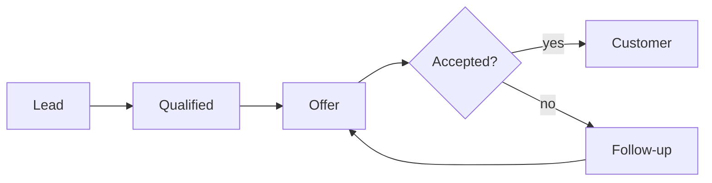

# Customer review 2026

Northwind Retail, January–September
{.lead}

```stats
- 4.8 M€: revenue
- 1 240: active customers
- 92 %: retention
```

## Agenda

1. Revenue by month
2. Customers and segments
3. Regions
4. Churn and its causes
5. The sales process
6. Next steps

## Revenue by month

Revenue grew every quarter; September was the best month.
{.lead}

```vega-lite
{"background":"rgba(0,0,0,0)","data":{"values":[{"m":"Jan","v":410},{"m":"Feb","v":432},{"m":"Mar","v":468},{"m":"Apr","v":495},{"m":"May","v":520},{"m":"Jun","v":548},{"m":"Jul","v":561},{"m":"Aug","v":590},{"m":"Sep","v":626}]},
"mark":"bar","encoding":{"x":{"field":"m","type":"ordinal","sort":null,"title":null},"y":{"field":"v","type":"quantitative","title":"k€"}}}
```

## Quarter over quarter

Each quarter added about a tenth.
{.lead}

| Quarter | Revenue k€ | Change |
| --- | --- | --- |
| Q1 | 1 310 | – |
| Q2 | 1 563 | +19 % |
| Q3 | 1 777 | +14 % |

## Customers by segment

Retail chains bring half of the revenue.
{.lead}

```vega-lite
{"background":"rgba(0,0,0,0)","data":{"values":[{"s":"Retail chains","v":50},{"s":"Independent stores","v":28},{"s":"Online","v":15},{"s":"Wholesale","v":7}]},
"mark":{"type":"arc","innerRadius":80},"encoding":{"theta":{"field":"v","type":"quantitative"},"color":{"field":"s","type":"nominal","title":null}}}
```

## Active customers

Growth came from new online customers.
{.lead}

```vega-lite
{"background":"rgba(0,0,0,0)","data":{"values":[{"m":"Jan","v":1050},{"m":"Feb","v":1072},{"m":"Mar","v":1101},{"m":"Apr","v":1124},{"m":"May","v":1150},{"m":"Jun","v":1171},{"m":"Jul","v":1188},{"m":"Aug","v":1215},{"m":"Sep","v":1240}]},
"mark":{"type":"line","point":true},"encoding":{"x":{"field":"m","type":"ordinal","sort":null,"title":null},"y":{"field":"v","type":"quantitative","title":"customers","scale":{"zero":false}}}}
```

## Regions

The south grows fastest; the north is the largest.
{.lead}

| Region | Revenue k€ | Customers | Growth |
| --- | --- | --- | --- |
| North | 1 820 | 410 | +6 % |
| South | 1 390 | 380 | +21 % |
| East | 980 | 260 | +11 % |
| West | 610 | 190 | +4 % |

## Churn

Churn fell from 11 % to 8 % after the new onboarding.
{.lead}

```stats
- 8 %: churn now
- 11 %: churn a year ago
- 99: customers lost
```

## Why customers leave

Price is the main reason, delivery times the second.
{.lead}

```vega-lite
{"background":"rgba(0,0,0,0)","data":{"values":[{"r":"Price","v":38},{"r":"Delivery time","v":27},{"r":"Product range","v":17},{"r":"Service","v":11},{"r":"Other","v":7}]},
"mark":"bar","encoding":{"y":{"field":"r","type":"nominal","sort":"-x","title":null},"x":{"field":"v","type":"quantitative","title":"% of lost customers"}}}
```

## The sales process



## Strengths and weaknesses

```swot
- Strengths: wide range, fast restocking
- Weaknesses: delivery times in the north
- Opportunities: online customers, the south
- Threats: price competition
```

## Two ways to grow

- **Online:** new customers every month, lower cost per order; needs faster delivery
- **The south:** the fastest growing region, two new chains signed; needs a local warehouse
{.c2}

## Delivery times

Deliveries in the north take twice as long as elsewhere.
{.lead}

```vega-lite
{"background":"rgba(0,0,0,0)","data":{"values":[{"r":"North","v":4.1},{"r":"South","v":2.2},{"r":"East","v":2.0},{"r":"West","v":2.4}]},
"mark":"bar","encoding":{"x":{"field":"r","type":"nominal","title":null},"y":{"field":"v","type":"quantitative","title":"days"}}}
```

## Plan for Q4

```timeline
- Oct Warehouse: open the southern warehouse
- Nov Delivery: two-day delivery in the north
- Dec Pricing: volume prices for chains
```

## Next steps

```cards
- Southern warehouse: decision by 15 October
- Delivery partner: tender for the north
- Pricing: proposal to the board in November
```
