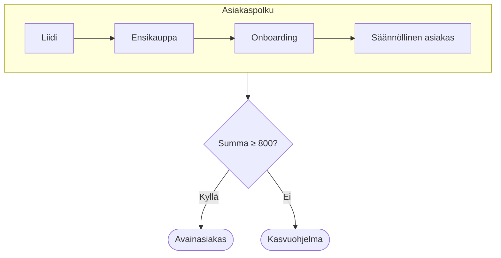

# Asiakaskunnan kasvusuunnitelma 2027

Asiakasdatan analyysi ja kasvun toimenpiteet vuodelle 2027
{.lead}

```stats
- 91: asiakasta
- 21: maata
- 51 292: transaktiot yhteensä
```

## Avainluvut

Asiakaskunta on laaja: 91 asiakasta 21 maassa, keskimäärin 563,65 per asiakas.
{.lead}

```stats
- 91: asiakasta
- 21: maata
- 69: kaupunkia
- 51 292: summa yhteensä
- 563,65: keskiarvo / asiakas
- 529: mediaani / asiakas
```

::: notes
Keskiarvo on mediaania korkeampi, eli muutama suuri asiakas nostaa keskiarvoa. Pohjana on 91 asiakkaan Customers-aineisto.
:::

## Suositus: 3 kohdemarkkinaa

Kasvu keskitetään kolmeen maahan, joissa on jo volyymia ja korkea keskiarvo.
{.lead}

```stats
- USA: Suurin markkina, 7 499 (14,6 %) ja 13 asiakasta
- Iso-Britannia: Korkein keskiarvo suurista maista (663,0), kärkiasiakas 1 607
- Brasilia: Keskiarvo 594,1 ja kolme ≥ 800 -asiakasta
```

::: notes
Maat valittiin korjatun datan perusteella: kokonaissumma, keskiarvo per asiakas ja asiakkaiden keskittyminen kaupunkeihin. Yhdessä ne tuovat 34,1 % kokonaissummasta.
:::

## Eurooppa vs. Amerikat

Eurooppa tuo 58,0 % summasta, mutta Amerikkojen asiakas on keskimäärin arvokkaampi (581,6 vs. 551,3).
{.lead}

```vega-lite
{
  "background": "rgba(0,0,0,0)",
  "data": {"values": [
    {"Maanosa": "Eurooppa", "Asiakkaita": 54, "Summa": 29771},
    {"Maanosa": "Amerikat", "Asiakkaita": 37, "Summa": 21521}
  ]},
  "hconcat": [
    {"title": "Asiakkaita", "width": 210, "height": 230,
     "layer": [
      {"mark": "bar", "encoding": {"x": {"field": "Maanosa", "type": "nominal", "title": null, "axis": {"labelAngle": 0}}, "y": {"field": "Asiakkaita", "type": "quantitative", "title": null}, "color": {"field": "Maanosa", "type": "nominal", "legend": null}}},
      {"mark": {"type": "text", "dy": -12}, "encoding": {"x": {"field": "Maanosa", "type": "nominal"}, "y": {"field": "Asiakkaita", "type": "quantitative"}, "text": {"field": "Asiakkaita", "type": "quantitative"}}}
     ]},
    {"title": "Summa yhteensä", "width": 210, "height": 230,
     "layer": [
      {"mark": "bar", "encoding": {"x": {"field": "Maanosa", "type": "nominal", "title": null, "axis": {"labelAngle": 0}}, "y": {"field": "Summa", "type": "quantitative", "title": null}, "color": {"field": "Maanosa", "type": "nominal", "legend": null}}},
      {"mark": {"type": "text", "dy": -12}, "encoding": {"x": {"field": "Maanosa", "type": "nominal"}, "y": {"field": "Summa", "type": "quantitative"}, "text": {"field": "Summa", "type": "quantitative"}}}
     ]}
  ]
}
```
{width=62%}

- **Eurooppa:** 15 maata, 54 asiakasta, 58,0 % summasta
- **Amerikat:** 6 maata, 37 asiakasta, 42,0 % summasta
- Keskiarvo: Amerikat 581,6, Eurooppa 551,3
{container=box background=#0B6E4F33}

::: notes
Amerikkoihin luettiin USA, Kanada, Meksiko, Brasilia, Argentiina ja Venezuela; muut 15 maata ovat Euroopassa. Amerikoissa on vähemmän mutta keskimäärin suurempia asiakkaita.
:::

## Top 10 maata

Neljä suurinta maata (USA, Ranska, Saksa, Brasilia) tuovat yhdessä 49,0 % kokonaissummasta.
{.lead}

```vega-lite
{
  "background": "rgba(0,0,0,0)",
  "height": 400,
  "data": {"values": [
    {"Maa": "USA", "Summa": 7499, "r": 1},
    {"Maa": "Ranska", "Summa": 6491, "r": 2},
    {"Maa": "Saksa", "Summa": 5814, "r": 3},
    {"Maa": "Brasilia", "Summa": 5347, "r": 4},
    {"Maa": "Iso-Britannia", "Summa": 4641, "r": 5},
    {"Maa": "Espanja", "Summa": 2582, "r": 6},
    {"Maa": "Venezuela", "Summa": 2578, "r": 7},
    {"Maa": "Meksiko", "Summa": 2425, "r": 8},
    {"Maa": "Argentiina", "Summa": 2181, "r": 9},
    {"Maa": "Kanada", "Summa": 1491, "r": 10},
    {"Maa": "Muut (11 maata)", "Summa": 10243, "r": 11}
  ]},
  "transform": [{"calculate": "datum.r <= 4 ? 'Top 4' : 'Muut'", "as": "Ryhmä"}],
  "encoding": {
    "y": {"field": "Maa", "type": "nominal", "sort": {"field": "r"}, "title": null},
    "x": {"field": "Summa", "type": "quantitative", "title": null}
  },
  "layer": [
    {"mark": "bar", "encoding": {"color": {"field": "Ryhmä", "type": "nominal", "legend": null, "sort": ["Top 4", "Muut"]}}},
    {"mark": {"type": "text", "align": "left", "dx": 6}, "encoding": {"text": {"field": "Summa", "type": "quantitative"}}}
  ]
}
```

::: notes
Muut-ryhmässä on 11 maata, joiden yhteissumma 10 243 on 20,0 % kokonaisuudesta. USA on suurin yksittäinen maa 14,6 %:n osuudella.
:::

## Top 10 asiakasta

Kymmenen suurinta asiakasta tuovat 19,8 % summasta; Around the Horn (1 607) nousee selvästi kärkeen.
{.lead}

| # | Asiakas | Kaupunki | Maa | Summa |
|---|---|---|---|---:|
| 1 | Around the Horn | London | Iso-Britannia | 1 607 |
| 2 | Comércio Mineiro | São Paulo | Brasilia | 971 |
| 3 | Save-a-lot Markets | Boise | USA | 971 |
| 4 | HILARIÓN-Abastos | San Cristóbal | Venezuela | 957 |
| 5 | Maison Dewey | Bruxelles | Belgia | 953 |
| 6 | Océano Atlántico Ltda. | Buenos Aires | Argentiina | 950 |
| 7 | Hungry Owl All-Night Grocers | Cork | Irlanti | 948 |
| 8 | White Clover Markets | Seattle | USA | 948 |
| 9 | Victuailles en stock | Lyon | Ranska | 942 |
| 10 | Cactus Comidas para llevar | Buenos Aires | Argentiina | 923 |

::: notes
Korjattu summa nostaa Around the Hornin ainoaksi yli 1 000:n asiakkaaksi. Muut kärkiasiakkaat ovat tasaisesti välillä 923–971, ja kuusi kymmenestä on Amerikoissa.
:::

## Asiakkuuden hoitomalli

Summa ratkaisee jatkon: ≥ 800 avainasiakkaaksi, muut kasvuohjelmaan.
{.lead}


{layout=keep}

::: notes
Raja 800 vastaa nykyistä ylintä kokoluokkaa, johon kuuluu 23 asiakasta. Kasvuohjelman tavoite on nostaa asiakkaita rajan yli.
:::

## Riskit

Suurimmat riskit liittyvät keskittymiseen suuriin maihin ja avainasiakkaisiin.
{.lead}

| Riski | Todennäköisyys | Vaikutus | Toimenpide |
|---|---|---|---|
| Avainasiakkaan menetys | Keskitaso | Suuri | Avainasiakasohjelma ja vastuuhenkilöt |
| Kysynnän lasku USA:ssa (14,6 % summasta) | Keskitaso | Suuri | Kasvu Euroopan pienissä maissa |
| Valuuttariski Amerikoissa (42,0 % summasta) | Korkea | Keskitaso | Hinnoittelu ja suojaus |
| Asiakasdatan laatuvirheet (esim. summa 607 → 1 607) | Keskitaso | Keskitaso | Tietojen validointi ennen raportointia |

::: notes
Todennäköisyys ja vaikutus ovat johdon arvioita, osuudet tulevat datasta. Jokaiselle riskille on nimetty toimenpide tiekartassa.
:::

## Tiekartta 2027

Yksi konkreettinen toimenpide per kvartaali, avainasiakkaista uusiin markkinoihin.
{.lead}

```timeline
- Q1 2027: Avainasiakasohjelma käyntiin
  - 23 asiakasta (≥ 800), nimetty vastuuhenkilö
- Q2 2027: Kasvuohjelma 300–599-luokalle
  - 30 asiakasta, lisämyyntikampanja
- Q3 2027: Pienten Euroopan maiden pilotti
  - Pohjoismaat ja Puola, uusien liidien haku
- Q4 2027: Tulosten arviointi
  - Kokoluokkasiirtymät mitataan, budjetti 2028
```

::: notes
Järjestys etenee nykyasiakkaiden suojaamisesta kasvuun ja uusiin markkinoihin. Q4:n arviointi syöttää vuoden 2028 suunnitelman.
:::

## Vahvuudet ja kehitettävää

Asiakaskunta on hajautettu ja arvokas kärjestään, mutta häntä on ohut.
{.lead}

| Vahvuudet | Kehitettävää |
|---|---|
| Laaja pohja: 91 asiakasta, 21 maata, 69 kaupunkia | 11 pienintä maata tuovat yhteensä vain 20,0 % summasta |
| ≥ 800-asiakkaat (23 kpl) tuovat 41,2 % summasta | 19 asiakasta (< 300) tuo vain 7,4 % summasta |
| Ei asiakasriippuvuutta: top 10 = 19,8 % summasta | Italian, Sveitsin, Ruotsin ja Norjan keskiarvo alle 400 |

::: notes
Vahvuudet ja kehityskohteet perustuvat suoraan asiakasdatan jakaumiin. Painopiste on keskiluokan nostamisessa ja pienten markkinoiden aktivoinnissa.
:::

## Yhteenveto

Kolme suositusta vuodelle 2027.
{.lead}

```process
- Suojaa kärki: avainasiakasohjelma 23 asiakkaalle, jotka tuovat 41,2 % summasta
- Nosta keskiluokkaa: kasvuohjelma 30 asiakkaalle luokassa 300–599
- Laajenna hallitusti: pilotit pienissä Euroopan maissa
```

::: notes
Suositukset on järjestetty vaikuttavuuden mukaan. Pyydämme hyväksyntää Q1:n avainasiakasohjelman käynnistämiselle.
:::
