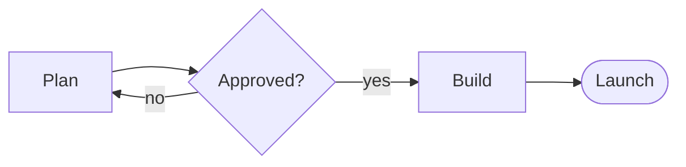
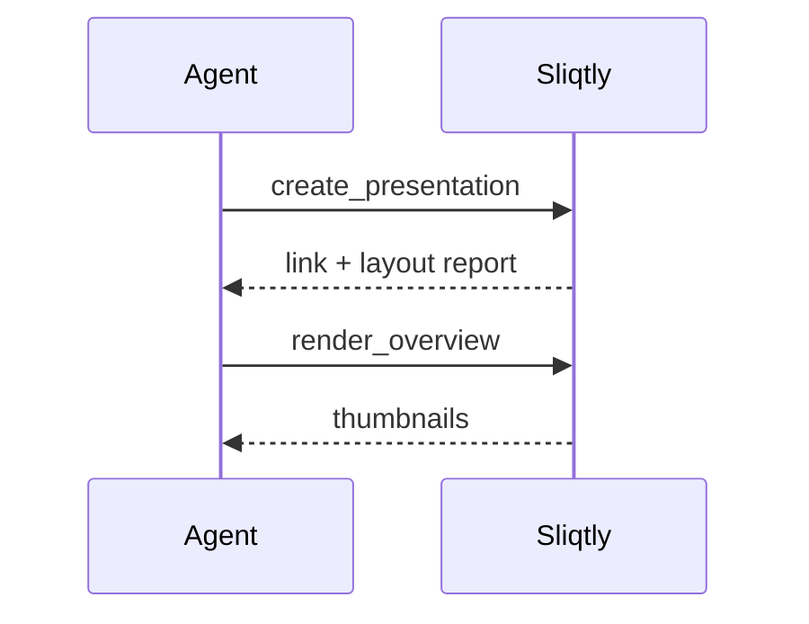
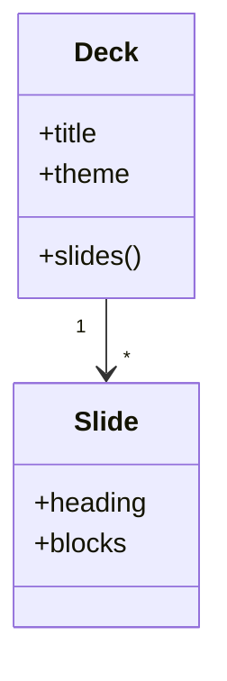
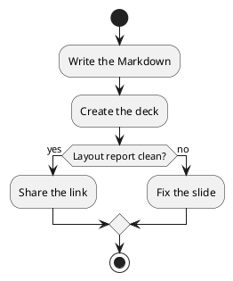
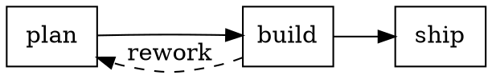

# Sliqtly features

What the Markdown can hold: charts, diagrams, layouts, math, code and pictures.
{.lead}

```stats
- 46: chart types tested against Vega
- 4: diagram languages
- 6: diagram looks
```

## Chart: Bar

Vega-Lite `bar`.
{.lead}

```vega-lite
{"background":"rgba(0,0,0,0)","data":{"values":[{"k":"A","v":28},{"k":"B","v":55},{"k":"C","v":43},{"k":"D","v":91},{"k":"E","v":81}]},"mark":"bar","encoding":{"x":{"field":"k","type":"nominal","title":null},"y":{"field":"v","type":"quantitative"}}}
```

## Chart: Stacked bar

`bar` with a colour channel.
{.lead}

```vega-lite
{"background":"rgba(0,0,0,0)","data":{"values":[{"q":"Q1","s":"North","v":30},{"q":"Q1","s":"South","v":20},{"q":"Q2","s":"North","v":34},{"q":"Q2","s":"South","v":26},{"q":"Q3","s":"North","v":38},{"q":"Q3","s":"South","v":33}]},"mark":"bar","encoding":{"x":{"field":"q","type":"nominal","title":null},"y":{"field":"v","type":"quantitative"},"color":{"field":"s","type":"nominal","title":null}}}
```

## Chart: Line and points

`line` with `point: true`.
{.lead}

```vega-lite
{"background":"rgba(0,0,0,0)","data":{"values":[{"m":1,"v":12},{"m":2,"v":18},{"m":3,"v":15},{"m":4,"v":24},{"m":5,"v":29},{"m":6,"v":27}]},"mark":{"type":"line","point":true},"encoding":{"x":{"field":"m","type":"ordinal","title":"month"},"y":{"field":"v","type":"quantitative"}}}
```

## Chart: Area

`area`.
{.lead}

```vega-lite
{"background":"rgba(0,0,0,0)","data":{"values":[{"m":1,"v":12},{"m":2,"v":18},{"m":3,"v":15},{"m":4,"v":24},{"m":5,"v":29},{"m":6,"v":27}]},"mark":"area","encoding":{"x":{"field":"m","type":"ordinal","title":"month"},"y":{"field":"v","type":"quantitative"}}}
```

## Chart: Scatter

`point`, size by a third field.
{.lead}

```vega-lite
{"background":"rgba(0,0,0,0)","data":{"values":[{"x":1,"y":3,"s":10},{"x":2,"y":5,"s":40},{"x":3,"y":4,"s":20},{"x":4,"y":8,"s":60},{"x":5,"y":7,"s":30},{"x":6,"y":9,"s":80}]},"mark":"point","encoding":{"x":{"field":"x","type":"quantitative"},"y":{"field":"y","type":"quantitative"},"size":{"field":"s","type":"quantitative","legend":null}}}
```

## Chart: Donut

`arc` with an inner radius.
{.lead}

```vega-lite
{"background":"rgba(0,0,0,0)","data":{"values":[{"k":"Chains","v":50},{"k":"Stores","v":28},{"k":"Online","v":15},{"k":"Wholesale","v":7}]},"mark":{"type":"arc","innerRadius":70},"encoding":{"theta":{"field":"v","type":"quantitative"},"color":{"field":"k","type":"nominal","title":null}}}
```

## Chart: Heat map

`rect` with a colour ramp.
{.lead}

```vega-lite
{"background":"rgba(0,0,0,0)","data":{"values":[{"d":"Mon","h":"9","v":3},{"d":"Mon","h":"12","v":8},{"d":"Mon","h":"15","v":5},{"d":"Tue","h":"9","v":4},{"d":"Tue","h":"12","v":9},{"d":"Tue","h":"15","v":6},{"d":"Wed","h":"9","v":2},{"d":"Wed","h":"12","v":7},{"d":"Wed","h":"15","v":9}]},"mark":"rect","encoding":{"x":{"field":"h","type":"ordinal","title":"hour"},"y":{"field":"d","type":"ordinal","title":null},"color":{"field":"v","type":"quantitative","title":null}}}
```

## Diagram look: classic

`{diagram=classic}`: the plain drawing.
{.lead}


{diagram=classic}

## Diagram look: sketch

`{style=sketch}`: hand-drawn.
{.lead}


{style=sketch}

## Diagram look: mermaid

`{style=mermaid}`: pastel cards on a dotted grid.
{.lead}


{style=mermaid}

## Diagram look: jurassic

`{style=jurassic}`: poster, ochre and grey.
{.lead}


{style=jurassic}

## Diagram look: cartoon

`{style=cartoon}`: speech bubbles, fat outlines.
{.lead}


{style=cartoon}

## Diagram look: romantic

`{style=romantic}`: caption boxes, terracotta circles.
{.lead}


{style=romantic}

## Mermaid: sequence



## Mermaid: class



## PlantUML: activity



## Graphviz DOT



## D2

```d2
direction: right
user: User { shape: person }
app: App {
  api: API
  db: Database { shape: cylinder }
  api -> db: query
}
user -> app.api: request
```

## Layouts from lists: process

```process
- Plan: goals, budget and schedule
- Build: code, content and tests
- Launch: open to everyone
```

## Layouts from lists: SWOT

```swot
- Strengths: small files, any MCP client
- Weaknesses: a young project
- Opportunities: decks that follow their data
- Threats: the big suites
```

## Layouts from lists: timeline

```timeline
- Q1 Kickoff: the first decks
- Q2 Charts: Vega-Lite in Ranger
- Q3 Local: your own server
```

## Layouts from lists: cards and stats

```cards
- Write: Markdown, or let the agent
- Check: layout report and pictures
- Share: link, PDF, PPTX, Word, HTML
```

## Tables with toned cells

| Risk | Impact | Status |
| --- | --- | --- |
| Data loss | High | Done |
| Slow export | Medium | Late |
| Font missing | Low | Done |
{cells="High=red Medium=amber Low=green Done=green Late=red"}

## Math (LaTeX)

Inline $e^{i\pi} + 1 = 0$, and as a display:

$$\int_0^1 x^2\,dx = \frac{1}{3} \qquad \sum_{k=1}^{n} k = \frac{n(n+1)}{2}$$

## Code

```ts {.numbers lines=2}
export function total(lines: Line[]): number {
  return lines.reduce((s, l) => s + l.price * l.qty, 0);
}
```

## Diff

```diff ts
@@ -1,3 +1,3 @@
 export function total(lines: Line[]): number {
-  return lines.reduce((s, l) => s + l.price, 0);
+  return lines.reduce((s, l) => s + l.price * l.qty, 0);
 }
```

## SVG picture

An SVG kept with the deck and drawn as vectors on the slide.
{.lead}


## SmartArt (partial)

PowerPoint's own diagram data, drawn from its layout (some layouts).
{.lead}


{layout=chevron1 colors=colorful1 width=80%}
