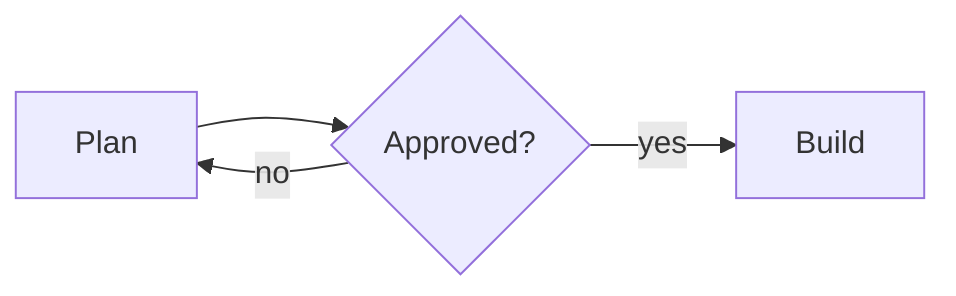

# Sliqtly guide

**Guide version 2026-10-10.** If a result names a newer version, read Core
again.

`sliqtly_guide()` returns this Core; `sliqtly_guide(topic="…")` returns one
topic. Each topic stands alone and describes how to do things.

A Sliqtly presentation is one Markdown document plus a theme (CSS). The
slides are drawn by the Sliqtly player at https://sliqtly.com.

## A deck

````markdown
---
title: Deck title
transition: fade          # fade | slide | zoom | none
lang: fi                  # number format in charts
footer-right: "{page} / {pages}"
---
# Deck title

## A slide {transition=slide}

- A point
- Another point
{.build anim=rise}

::: notes
Speaker notes.
:::
````

- `#` is a title slide, `##` starts a slide.
- `{…}` on the line after a block applies to that block; on a heading line,
  to the slide.
- Block attributes: `.lead` `.kicker` `.center` `.right` `.c2` `.c3`
  `.build`, `width=60%`, `container=box|bubble`.
- A slide whose content runs over continues on the next slide (the result
  says so).
- Pictures, SVG and SmartArt files go in `images` and are referenced as
  ``.

## Work loop

1. `create_presentation`, then read the layout report: every ⚠ line and
   every `warnings` entry.
2. Fix with `update_presentation` + `edits` (find/replace, one slide, new
   slides). Send the whole `markdown` for a rewrite.
3. `render_overview` once before giving the link; `render_slide` for
   charts, diagrams and any ⚠.
4. Give the user the link and say anyone with it can see the deck (unless
   `visibility: "private"`).
5. When a read or a save lists changes the user made by hand (`user_edits`),
   keep them; a save that overwrote one says so → topic=editing.

A warning that ends with `→ topic=x` names the topic that explains it.
<!-- rooms -->

On this server presentations are kept in rooms: read `topic=rooms` before
the first `create_presentation`.
<!-- /rooms -->

## Themes

`aurora` (default), `nebula`, `carbon`, `ember`, `midnight` are dark;
`editorial` is an A4 portrait document where `#` starts a page.

Light slides, white or near-white paper: `white` (plain white, no
background), `corporate` (plain), `pearl`
(soft pastel light from two corners), `hive` (fine honeycomb along the
right edge), `lattice` (pale diagonal tiles, clear in the middle), `apex`
(blue accent triangles and quarter circles in the corners), `tide` (blue
line waves along the bottom), `mist` (halftone dots from two corners).

Work themes, condensed Fjalla One headings and blocks of colour down the
right edge: `forge` (white, charcoal and orange), `foundry` (dark charcoal,
orange headings), `site` (light, charcoal and safety yellow).

Health themes, Lato headings: `clinic` (white and teal, a heartbeat line
along the bottom), `care` (pale blue, cyan honeycomb at the right edge),
`vital` (white, cyan and mint light in two corners).

The light themes' backgrounds are `deck { art: … }` in the theme CSS
(`waves`, `honeycomb`, `lattice`, `corners`, `glow`, `halftone`, `tide`,
`blocks`, `pulse`), drawn
from the `figure { colors }` and kept as shapes in PDF and PPTX;
`{art=off}` on a heading leaves it off that slide.

`nebula` (starfield) and the `fx=` effects (`smoke`, `starfield`,
`plasma-wave`…) are for show pieces; for an ordinary deck don't pick them
by default. Readability comes first.

## Topics

| `topic=` | Read when |
|---|---|
| `layout` | placing things side by side, columns, plates, alignment, books |
| `effects` | transitions, build steps, background effects, line art |
| `text` | lists, quotes, inline HTML, code, diffs, math, tables |
| `charts` | Vega-Lite charts, data sources, number formats |
| `diagrams` | Mermaid, Graphviz DOT, D2, PlantUML, XState statecharts; styles and tours |
| `figures` | `process` `timeline` `swot` `cards` `stats` list layouts |
| `smartart` | PowerPoint SmartArt diagrams |
| `pictures` | photos, SVG, backgrounds, galleries |
| `css` | colours, fonts, spacing; selectors and properties |
| `data` | Excel / CSV / JSON files, `table` and `sheet` blocks |
| `apps` | a program or game running on a slide (`app` blocks, TSX + CSS) |
| `scripts` | a program that moves the slide's own text, chart bars and diagram nodes (`{script=…}`) |
| `editing` | `edits`, another assistant on the same deck, review comments, the layout report |
| `export` | PDF, PPTX, DOCX, HTML, print pages with bleed |
| `limits` | quotas, sign-in, privacy, deleting decks |
<!-- rooms -->
| `rooms` | rooms for presentations, a room's chat |
<!-- /rooms -->

<!-- topic: layout -->
# Topic: layout

Blocks are laid out top to bottom under the heading.

| To get | Write |
|---|---|
| Picture, chart or table with text beside it | the picture/chart/table first with `{width=50%}`, then the text |
| A list in two or three columns | list + `{.c2}` / `{.c3}` |
| Two-by-two grid | `swot` fence (topic `figures`) |
| A row of headed boxes | `cards` fence (topic `figures`) |
| Centered or right-aligned lines | `{.center}` / `{.right}` / `{.left}` under a heading or paragraph |
| A large intro line | `{.lead}` |
| A small label | `{.kicker}` |
| Text over a picture | `## T {bg=media/x.jpg}` and `{container=box}` under the text, or `bg-dim=0.4–0.8` |
| A speech bubble | `{container=bubble}` |
| A slide with its heading hidden | `## Name {heading=hidden}` (the name stays in the overview) |
| A ticket number or owner kept with the deck or a slide | `jira: ACME-400` in the front matter, `## Name {jira=ACME-412}` on a slide (data, not drawn) |
| Photos in a grid or one per slide | `gallery` fence (topic `pictures`) |

- `.center` / `.right` / `.left` set a heading's or paragraph's lines
  (`# Title` then `{.center}` on the next line). In `css`, `text-align`
  does the same for a kind of block: `h1 { text-align: center }`. Lists,
  tables and code stay left.
- `container=box` spans the column; `container=bubble` is as wide as the
  text with a speech-bubble tail. Under a paragraph, a list or on a heading
  (`## Title {container=box}`, also with `bg=media/x.jpg` on the same
  heading: the plate goes round the title, the picture fills the slide).
- Plates take the slide's colour by default; `background=#ffffffcc` sets
  one, `padding=12px` and `radius=8px` its padding and corners. The text on a plate turns dark or light to read on it. For every
  plate: `container { background-color; border-radius }` in `css`.
- Under a chart's or diagram's fence `{container=box}` puts a plate round
  it, so its axes read over a bright background picture without dimming
  the whole picture.
- When text on a picture is hard to read ("low contrast"), raise that
  slide's `bg-dim` (0.6–0.8) or put the text (or the chart) on a plate;
  the picture stays as it is.
- `{width=62%}` under a chart or table puts what follows beside it.
- A table that runs a few rows over its slide is set smaller by itself.
- A slide whose content runs over its height is split onto the next slide.

## Placing content on a slide

A slide's blocks go one under the other from the top, unless the slide or
a container says otherwise.

````markdown
## Before and after {layout=comparison}

### Before
- Slides made by hand

### After
- Markdown

## Results {layout=image-right}

- Growth continued
- Costs fell


::: columns
```ts
const total = sum(rows);
```
{width=55%}

- `sum` adds the rows
:::
````

- `::: columns` … `:::` puts what is in it side by side. The columns are
  read from what is inside, the first rule that applies: `::: col` blocks
  (one column each; nest them in `:::: columns` with four colons, or write
  `::: col` blocks one after another without a wrapper; `::: col Title`
  sets a title over the column); `---` lines between the parts; headings
  (a column starts at each heading of the highest level there, text
  before the first one goes across above the columns); pictures, charts,
  diagrams and galleries next to other blocks (the pictures in one column,
  the rest in the other, on the side the first block is on); otherwise
  each block is a column of its own.
- Any block fits in a column: headings, lists, code, tables, pictures,
  charts, diagrams. `{width=40%}` under a column's only block sets that
  column's width (the block then fills its column);
  `{widths="60 40"}` under the closing `:::` sets them all.
- On a slide's heading, `layout=` does the same for the slide's content:
  `columns` or `comparison` (columns by sub-headings, else by blocks),
  `two-column`, `image-right` / `image-left` (pictures, charts and
  diagrams in a column at that side, the rest in the other).
  `widths="60 40"` goes on the heading too.
- `valign=center` (or `layout=center`) or `valign=bottom` on a slide's
  heading sets the content under the title in the middle or at the foot
  of the room under it; `valign: center` in the front matter does it for
  every slide that does not say `valign=` itself.
- `layout=section` (also `layout=title`): the title and the lines under it
  together in the middle of the slide, centred.
- `layout=statement`: the text under the title set at the title's size, in
  the middle of the slide; the title is not drawn but still names the
  slide. A statement slide with no text under it shows its title larger,
  in the middle.
- `{float=top-right width=8%}` under a picture (also `top-left`,
  `bottom-right`, `bottom-left`) sets it in that corner of the slide, out
  of the flow: the title and the text after it go beside it. Write it right
  under the slide's heading.
- `{width=50%}` under a picture, chart, table or code block puts the
  blocks after it beside it (paragraphs, lists, quotes), down to its
  bottom.
- Text beside a picture or chart, or in a column, is set as large as the
  slide has room for, as text alone on a slide is.

## Your own data

A front matter key Sliqtly does not read is the presentation's own data
(`jira: ACME-400`, `owner: Tero`); a key on a slide's heading is that
slide's (`## Revenue {jira=ACME-412}`), and goes over the presentation's.
Neither is drawn. The result names the presentation's as `Presentation
data: jira=ACME-400` and the layout report a slide's as
`- data: jira=ACME-412`; a header or footer prints one
(`footer-right: "{jira}"`). `meta-<key>` is data whatever it is called, for
a key Sliqtly would otherwise read as a setting (`meta-title:`,
`{meta-width=wide}`). A key one letter from one Sliqtly knows (`tilte:`,
`{transtion=fade}`) is kept as data and comes back as a warning.

## Headers and footers

In the front matter: `header`, `footer`, or one place on an edge:
`header-left`, `header-center`, `header-right`, `footer-left`,
`footer-center`, `footer-right`. `{page}`, `{pages}`, `{title}` and any of
the slide's own data keys are filled in. Also `header-image: media/logo.png`, `header-color`,
`header-background`, `header-size`, `header-skip` (and the same for
`footer-`).

## Books

`mode: book` in the front matter makes the deck a book: its pages face
each other in spreads, and the player and the shared link show a spread at
a time.

```yaml
---
mode: book            # slides (default) | book
render: realistic     # flat (default) | realistic
book-start: right     # right (default): page 1 alone on the right; left: 1 and 2 face each other
page: 200x200mm       # the page's size, as for any deck
margin: 14mm          # every edge, or one: margin-top, margin-bottom,
margin-inside: 20mm   # margin-inside (at the binding), margin-outside
---
```

- Each slide is one page. Page 1 is a right-hand page; with
  `book-start: right` the spreads are 1, 2–3, 4–5, …
- `margin-inside` is on the right of a left-hand page and on the left of a
  right-hand one; pictures with `layout=full` are not moved by it. The
  margin keys also work without `mode: book` (inside = left).
- `render: realistic` shows the pages as paper on the shared link and
  while presenting in the editor: a shadow at the binding, and a page can
  be turned by dragging its outer edge or with the arrow keys. `flat` shows
  the two pages side by side.
- The PDF export has single pages (topic `export`).

<!-- topic: effects -->
# Topic: effects

Front matter, for every slide:

```yaml
transition: fade        # fade | slide | zoom | morph | none
seconds: 0.6            # transition length in seconds
step: 1.2               # seconds between build steps when played
hold: 2.5               # seconds after the last step
```

- Slide attributes on the heading line: `transition=fade|slide|zoom|morph|none`,
  `seconds=0.5`, `duration=8`, `fx=<effect>`, `bg=media/<picture>`,
  `bg-dim=0.4`, `art=waves`.
- `transition=morph`: what this slide and the one before both have (the
  same `{#id}`, else a block of the same kind with the same text) moves
  from its place there to its place here while the rest fades. PowerPoint
  files get a fade.
- Build steps: `.build` under a list reveals it one item at a time;
  `anim=fade|rise|fly|zoom` and `seconds=0.8` set how. A code fence with
  `.build` steps through its highlighted lines (topic `text`).
- Effects (`fx=`): `starfield`, `plasma-wave`, `smoke`, `ambient-light`,
  `aurora`, `ripple`, `liquid-glass`, `raindrop`, `drops` (rain running down
  a window), `raindrops2` (rain whose running drops leave lines of water),
  `bubbles` (round drops); `none` turns a theme's effect off on a slide.
  Parameters as `fx-density=1.6`, `fx-hue=228`, `fx-rain=2`.
- Music: `music: media/song.mp3` in the front matter (an mp3 in the deck's
  files or an https address) plays while presenting; M turns it off and on.
  Effects that move with it: `spectrum` (a ring of bars; `fx-x`, `fx-y`,
  `fx-size`, `fx-bars`), `kaleido` (`fx-segments`, `fx-twist`, `fx-speed`),
  `ridges` (`fx-rows`, `fx-height`, `fx-line`); all take `fx-hue` and
  `fx-dark` 0-1. Without music they move calmly by themselves.
- Effects are for show pieces; for an ordinary deck don't pick them by
  default. Readability comes first.
- Line art: `art=waves` draws line art behind the slide; `art-seed=3` draws
  another picture of it, `art=off` none; `art: waves` in the front matter
  puts it behind every slide. Line art named in the document is drawn only
  for signed-in PRO decks.
- Background art of a theme: `deck { art: honeycomb }` in its CSS (one of
  `waves`, `honeycomb`, `lattice`, `corners`, `glow`, `halftone`, `tide`,
  `blocks`, `pulse`;
  `art-seed: 3` moves it) is drawn behind every slide for everyone, in the
  `figure { colors }`. The light themes `pearl`, `hive`, `lattice`, `apex`,
  `tide`, `mist` and the work themes `forge`, `foundry`, `site` and the health themes
  `clinic`, `care`, `vital` use it; `art=off` on a heading leaves it off that slide.
- `render_slide` and `render_overview` draw the deck's own effects
  (below), not the built-in ones; the player draws both.

## Own effects (```fx)

A deck can define its own effect in a ```fx block anywhere in the
Markdown (it draws nothing where it is written); a theme can carry the same
text as `@effect …`. A slide uses it like a built-in one.

````markdown
```fx
effect embers source {
  param speed = 1 [0, 5]     // name = default [min, max], a number
  param heat = 0.6 [0, 1]
  still = 3                  // seconds a still (thumbnail, PDF, PPTX) shows
  fallback = #1a0a04         // the colour under the effect

  n = fbm(uv * vec2(4, 6) + vec2(0, time * 0.4 * speed), 5)
  glow = smoothstep(1 - heat, 1, n + (1 - uv.y) * 0.35)
  output = rgba(mix(#ff3d00, #ffd54f, glow), glow)
}
```

## Hot {fx=embers fx-heat=0.75}
````

- `effect <name> <layer> { … }`: the name is lowercase letters, digits and
  dashes, not a built-in effect's name (the list above). Layers: `source`
  paints the slide's background (the text over it), `backdrop` rewrites the
  finished slide (read it with `source(uv)`), `filter` the same for an
  element. In all three `output`'s alpha is how much covers what was
  there: `rgba(c, 0)` leaves the pixel as it was.
- The body is assignments, one per line, each name set once, ending in
  `output = <vec3 or vec4 colour>`. No loops or functions of one's own.
- Inputs: `uv` (vec2, 0..1, y down), `p` (page pixels), `size` (vec2),
  `time` (seconds since the slide came on screen), `edge` (pixels to the
  edge, negative inside), `PI`.
- The slide's clock, for an effect tied to its build steps: `step` (the
  step shown, 0 before the first), `steps` (how many), `steptime` (seconds
  since the shown step began), `progress` (0..1 through the slide). A
  reveal on a click: `a = smoothstep(0, 1.5, steptime) * select(step >= 1,
  1, 0)`. A still (thumbnail, PDF, PPTX) shows the last step, progress 1,
  `time` and `steptime` at `still`. `time` keeps running while a step
  waits for a click; `steptime` stops with the slide's clock.
- Values: numbers, `#rgb` / `#rrggbb` colours (a vec3, usable in sums:
  `#ff8800 * 0.5`), `#rrggbbaa` (a vec4), `vec2(…)`, `vec3(…)`, `vec4(…)`,
  parts `.x .y .xy .rgb .a` (letters of one set, `xyzw` or `rgba`),
  `+ - * /`, unary minus (`-x`), comparisons only inside
  `select(a < b, x, y)`.
- Functions: `sin cos tan asin acos atan abs floor ceil fract sqrt exp log
  sign normalize min max mod pow step clamp mix smoothstep length distance
  dot`, and `hash(v2)`, `noise(v2)`, `fbm(v2, octaves 1..8)`,
  `voronoi(v2)`, `rotate(v2, degrees)`, `hsv(hue°, s, v)`,
  `rgba(colour, alpha)`, `source(uv)` (backdrop and filter only).
- A body has a cost per pixel, limit 600: an operation 1, a function 2,
  `hash` 5, `noise` 12, `voronoi` 42, `fbm` 12 per octave. The check
  reports each effect's cost; more than the limit is refused. Errors name
  the line and come back in the check's warnings.
- `render_slide` draws them as the player does, at `still`; pass `time`
  (seconds into the slide) to see a moment, the clock with it.
- A shared deck shows these effects to its viewers; raw shader code is not
  accepted.

<!-- topic: text -->
# Topic: text

- Lists: `-` bullets, `1.` numbers, nesting by indenting, `- [x]` / `- [ ]`
  checklists.
- Quotes: `> text`; a source line under it with `{.right}`.
- Inline HTML: `<b>`, `<strong>`, `<i>`, `<em>`, `<u>`, `<s>`, `<del>`,
  `<ins>`, `<mark>`, `<code>`, `<kbd>`, `<sub>`, `<sup>`, `<small>`, `<q>`,
  `<abbr>`, `<a href>`, `<span>` and `<br>`; entities (`&amp;`, `&copy;`,
  `&#8364;`). A `style` on a span reads `color`, `background-color`,
  `font-size` (pt, px, em, rem, %, `large`…), `font-weight`, `font-style`
  and `text-decoration`; colours as `#hex`, `rgb()` or names.
- HTML blocks: `<ul>` / `<ol start="3">` with `<li>` (nested too) become
  lists. `<div style="background:#123; color:#fff; padding:16px;
  border-radius:8px">` becomes a `container=box` plate. `` on a line of its own is a picture like `` (a web
  address is fetched into `media/`). An `<svg>…</svg>` on lines of its own
  is drawn as a picture; scripts, event attributes, `<foreignObject>`,
  `<image>` and outside links are removed from it. `<iframe>`, `<video>`,
  `<audio>`, `<script>` and `<style>` are not drawn and show as text.
  Tags and styles that are not drawn come back as warnings. `javascript:`
  links are removed.
- Tables: Markdown tables with `:---` / `---:` / `:---:` alignment, or HTML
  `<table>` with `rowspan` / `colspan`. An HTML cell reads
  `style="background:…; color:…; font-weight:bold"` and `bgcolor`; a table
  inside a cell is drawn as its rows on lines. Colour cells by their text:
  `{cells="Late=red Done=green"}` under the table (the whole cell's text,
  any case; tones `red amber green blue grey` or a colour; on the line
  after `</table>` for an HTML table). A matched cell
  gets a muted tint of the tone and bold, readable text, in the PDF,
  PowerPoint, Word and HTML too. For every table of a deck:
  `table { cell-tones: "Done=green Late=red" }` in `css`.
- Code: a fence with the language (js, ts, py, rust, go, java, c, cpp, cs,
  sql, json, sh, …) is coloured. `.numbers` (or `numbers=40`, the first
  number) puts line numbers in a gutter; `lines=3-5,9` highlights those
  lines; `lines=3-5|9|12` with `.build` highlights them one build step after
  another: ```` ```ts {.numbers lines=2|4-5 .build} ````.
- Diffs: ```` ```diff ts ```` colours `+` lines on green, `-` lines on red,
  `@@` hunk headers and file headers dimmed, the code as TypeScript.
  `.numbers` follows the hunk headers' new-file side, and `lines=`
  highlights by those numbers. Paste `git diff` output as it is. Keep a
  slide to one hunk of about 15 lines.
- Math: `$…$` inline, `$$…$$` as a display, or a ```` ```math ```` fence
  (TeX).

## A pull request as source

`read_github_pr` (`pr`: its link, or `owner/repo#12`) reads a GitHub pull
request: title, description, state, files with their patches, commits. It
returns them and a first draft of a review deck with ```` ```diff ````
slides; change the draft and create it with `create_presentation`. Public
repositories work as they are; a private one needs separate access.

<!-- topic: charts -->
# Topic: charts

```` ```vega-lite ```` with a Vega-Lite v5 spec and
`"background": "rgba(0,0,0,0)"` so the theme shows through.

- **Colours** come from the theme: `chart { color; accent-color;
  chart-style: flat|forge|neon|glass }` in `css`. `{chart-style=neon}`
  under the fence (flat, forge, neon, glass, or a look: mermaid, jurassic,
  cartoon, romantic) styles that chart alone. In a chart coloured by a
  computed group, the groups take the palette in alphabetical order unless
  the colour encoding gives `"sort": [...]`.
- **Encoding types**: `quantitative`, `ordinal`, `nominal`, `temporal`
  (Vega-Lite rejects any other, such as `"point"`). A field the data does
  not have is warned about with the nearest name.
- **Data**: inline `values`; a deck file `data/x.csv`; a workbook sheet
  `data/<book>-<Sheet>.csv` (topic `data`); a public `https` URL
  (`"data": {"url": "https://…/x.csv"}`, or `.json`) or a Google Sheet
  `{"source": "google-sheets", "id": "<id or link>", "sheet": "Monthly",
  "range": "A:B"}` (or `"range": "Monthly!A:B"`, or `"gid": 123`), read
  each time the deck opens. The sheet must be shared as "Anyone with the
  link". `bind_chart_data` points an existing chart at a source. PDF and
  PPTX exports are snapshots of the data when exported.
- **Numbers and dates**: `lang: fi` (or `sv`, `de`, `fr`…) in the front
  matter writes `1 234,50` and that language's month and day names; `format` in an encoding or a text mark sets the pattern
  (`",.2f"`).
- **Value labels**: a `bar` layer and a `text` layer sharing the encoding;
  a `"sort": "-x"` on the shared `y` orders both.
- **Many categories**: horizontal bars (`y` category, `"sort": "-x"`).
- **Beside text**: the chart first with `{width=60%}`, then the text.
- **Pictures in a chart**: an `image` mark with `"url": {"field": "img"}`
  draws the deck's own pictures (`"media/logo.svg"`), sized by the mark's
  `width` / `height`; a picture the deck does not have is not drawn.
- **Over a picture**: `{container=box}` under the fence puts a plate round
  the chart.
- **Maps**: a `geoshape` mark with inline GeoJSON data.
- The report lists missing data files, wrong encoding types, unknown
  fields and chart styles, labels drawn over each other and text under
  20 px.

<!-- topic: diagrams -->
# Topic: diagrams

Fences: `mermaid`, `dot` / `graphviz`, `d2`, `plantuml` / `puml`, `xstate`. The
diagram fills the room under the heading; keep the slide to the diagram.

**Options** on the line under the fence:

| Option | Effect |
|---|---|
| `tour=on` | guided tour box by box when the slide opens (▶ beside the zoom buttons, T while presenting) |
| `layout=keep` | keep the direction as written |
| `style=sketch` / `mermaid` / `jurassic` / `cartoon` / `romantic` | drawing styles: hand-drawn; pastel cards on a dotted grid; poster with ochre circles; speech bubbles with fat outlines; black caption boxes with terracotta circles |
| `diagram=classic` | the plain drawing on the slide background, still, no tour, link styles exact |
| `zoom=2` | largest scale a box is drawn at (default 3) |
| `ball=off`, `choose=off` | no travelling light / no stop at named branches |
| `width=60%` | narrower, with something beside it |

Node shapes, `classDef`/`style` fills, dashed borders, the kind of each
link and the colours a diagram gives its links (`linkStyle`, DOT `color`)
show in every style; other colours come from the theme's `diagram` rule.

**Size**: about 4 boxes across and 10–12 in all reads best; split a bigger
one over slides. A wider diagram is shrunk, text and all. For a Mermaid
flowchart or DOT graph without `layout=keep`, a long chain is cut into
columns (a left-to-right one into rows) and the other direction is tried,
whichever draws larger; a flow is cut only between two boxes joined by a
single link. A sequence diagram is never toured: keep it to 4–5
participants.

**Mermaid** `flowchart`/`graph` (TD TB BT LR RL): every node shape,
`subgraph`, `classDef`/`class`/`style`, link labels `-->|yes|`, link types
`-.->` `==>` `--o` `--x` `<-->` `~~~`, `linkStyle n` (or `default`) with
`stroke`, `stroke-width`, `stroke-dasharray`. A node id may contain `-` and
`.`; `end` is a keyword. A Markdown label ``A["`**bold**`"]`` is drawn as
plain text. `click` is ignored. Also `sequenceDiagram`, `classDiagram`,
`stateDiagram-v2`, `erDiagram`, `mindmap`, `timeline`, `journey`, `gantt`,
`gitGraph`, `pie`, `quadrantChart`, `xychart`, `sankey`, `block`,
`architecture`, `kanban`, `requirement`, `C4Context`, `packet`,
`radar-beta`, `treemap`.



**Graphviz DOT**: `graph`/`digraph`, `strict`, `rankdir`, clusters
(`subgraph cluster_x { label="…" }`), node and edge defaults, `shape`,
`label`, `style`, `color`, `fillcolor`, `fontcolor`, `penwidth`,
`arrowhead`, `dir`; `layout=neato|fdp|sfdp` force layout, `twopi|circo`
rings. Text Graphviz would reject is refused.

**D2**: shapes, containers, connections and arrowheads, labels,
`direction`, `style.*`, `classes`, `vars`, globs, `sql_table`, `class`. Not
drawn: `@imports`, `layers`/`scenarios`/`steps`, `grid-columns`, `icon`,
`shape: image`, `near` to another shape, LaTeX, `shape: sequence_diagram`
lifelines.

**PlantUML** (`@startuml … @enduml`): sequence, class, object, component,
deployment, use case, activity (`start`, `:action;`, `if (…) then (…)` /
`else` / `endif`, `while`, `repeat`, `fork`, `stop`). Not drawn: state,
timing, mind map, WBS, Gantt, JSON/YAML, salt, ditaa; `!` lines,
`skinparam` and colours are dropped; only the first `@startuml` block is
drawn.

**XState** (`xstate`): an XState v5 machine config, as JSON or as a
Stately `createMachine({...})` export, drawn as a statechart: nested and
parallel states, the initial state of each level as a dot, `type: "final"`
states with a double border, and transitions labelled
`event [guard] / actions`. Several alternatives for one event are numbered,
and the unguarded last one reads `[else]`. Also drawn: `always`, `after`
(delays as `after 5s`), `onDone`, `invoke`, `entry`/`exit`, and the
machine's own `on` as "any state". Guards and actions are names (a string or
`{ type }`); a config with a function in it is refused. A target naming no
state is reported and its arrow left out. Styles and `tour=on` work as for
flowcharts.

```xstate
{
  "id": "review",
  "initial": "draft",
  "states": {
    "draft": { "on": { "SUBMIT": "testing" } },
    "testing": {
      "on": {
        "ACCEPT": { "target": "accepted", "guard": "role:tester" },
        "REJECT": { "target": "draft", "actions": ["addComment"] }
      }
    },
    "accepted": { "type": "final" }
  }
}
```

When a diagram cannot be read, its place shows the reason with the line
number, and the layout report flags it. A Mermaid flowchart is refused
where Mermaid refuses it (an unclosed `[`, a link that ends at no box).

<!-- topic: figures -->
# Topic: figures

Lists drawn as shapes, in the theme's colours, into PDF and PowerPoint as
editable shapes. One item per line as `Title: description`; an indented
`- point` belongs to the item above.

| Fence | Draws |
|---|---|
| `process` | chevron steps |
| `timeline` | badges on a line, a card under each; `2027 Launch:` puts `2027` in the badge, otherwise the badges are numbered |
| `swot` | 2×2 grid of four items |
| `cards` | numbered cards in a row |
| `stats` | `Number: label`, the number large on a card |

````markdown
```process
- Plan: goals, budget and schedule
- Build: code, content and tests
- Launch: open to everyone
```
````

`{width=60%}` narrows one. CSS: `figure { colors: #… #…; card-background:
#fff; box-shadow: 0 6pt 18pt rgba(0,0,0,.12) }`.

<!-- topic: smartart -->
# Topic: smartart

A SmartArt data model (`dgm:dataModel`, as in a .pptx's
`ppt/diagrams/data1.xml`), sent in `images` as `name: "steps.xml"` with the
XML as it is in `text` (or base64 in `data_base64`), drawn as a picture: ``. A
link, `[…](media/steps.xml)`, shows only its text. Options on the line
under it: `{layout=chevron1 colors=colorful1 style=simple2 width=80%}`.

Smallest file: a `doc` point (its `prSet loTypeId` may name the layout),
one point per item, and a connection from the parent to each item; a
sub-item connects to its item.

```xml
<dgm:dataModel xmlns:dgm="http://schemas.openxmlformats.org/drawingml/2006/diagram" xmlns:a="http://schemas.openxmlformats.org/drawingml/2006/main">
  <dgm:ptLst>
    <dgm:pt modelId="0" type="doc"><dgm:prSet loTypeId="urn:microsoft.com/office/officeart/2005/8/layout/process1"/></dgm:pt>
    <dgm:pt modelId="1"><dgm:t><a:p><a:r><a:t>Plan</a:t></a:r></a:p></dgm:t></dgm:pt>
    <dgm:pt modelId="2"><dgm:t><a:p><a:r><a:t>Build</a:t></a:r></a:p></dgm:t></dgm:pt>
  </dgm:ptLst>
  <dgm:cxnLst>
    <dgm:cxn srcId="0" destId="1"/>
    <dgm:cxn srcId="0" destId="2"/>
  </dgm:cxnLst>
</dgm:dataModel>
```

Layouts drawn, with the items each expects (an item is a point connected
to the document; a sub-item is connected to an item):

| Layout | Draws | Items |
| --- | --- | --- |
| `process1` | steps with arrows | any; sub-items under their step |
| `chevron1` | chevron steps | any |
| `hProcess9` | blocks along one wide arrow | any |
| `default` | blocks in rows that wrap | any |
| `vList2` | a bar per item, sub-items as bullets under it | any |
| `hList1` | a column per item, sub-items under its heading | any |
| `lProcess2` | a column per item, sub-items as blocks in it | any |
| `bList2` | blocks in rows (PowerPoint's pictures are not drawn) | any |
| `cycle2` | items on a circle, arrows round it | any |
| `cycle4` | quarters of one circle | 4 at most |
| `radial1` | one item in the middle, its sub-items round it | 1 item with sub-items |
| `venn1` | overlapping circles | any |
| `target1` | nested rings, the first outermost | 5 at most |
| `pyramid1` | a triangle cut into levels, the first at the apex | any |
| `funnel1` | items poured into a funnel, the last comes out | any |
| `gear1` | meshing gears | 3 at most |
| `arrow2` | points on a rising arrow, each named under it | 5 at most |
| `matrix1` | four quadrants | 4 items, or 1 item (the title, in the middle) with 4 sub-items |
| `hierarchy1`, `orgChart1` | a tree, each item over the items under it | 1 top item; in `orgChart1` a point with `type="asst"` is an assistant |

Items a layout has no place for are not drawn, and the result names them.
Another layout id is drawn as `default` and the result says so. Colours: `accent0_1` …
`accent6_5` (one theme colour), `colorful1` … `colorful5` (cycling
accents). Styles: `simple1` (the default), `simple2` (a thicker outline), `simple3` …
`simple5` (a shadow, larger with each; on a dark theme cast in the theme's
ink).

A diagram with nothing beside it and no `width=`/`height=` is laid out
across the content width, and a row of steps that would be a thin strip
wraps into rows; `width=` keeps it in its own box. Text that would not read
on what is under it is set in the theme's paper or ink colour.

A SmartArt saved by PowerPoint (a Flat OPC `pkg:package` holding its data,
layout, style, colours and drawing) is drawn as PowerPoint drew it, or
laid out again when `layout=`, `colors=` or `style=` is given. The PDF
carries it as drawn; the PowerPoint export carries SmartArt that PowerPoint
can edit.

<!-- topic: pictures -->
# Topic: pictures

- ``, `{width=40%}` under it. Pass the picture in the
  call's `images` with the same `name`: a public `https` URL, base64 data,
  or an SVG's (or a SmartArt file's) source as `text`. PNG, JPEG, GIF, WebP, SVG up to 5 MB each,
  at most 20 pictures in one call (send more with `update_presentation`).
- A picture written with a web address (``, or
  `![Logo][id]` with `[id]: https://…`) is fetched into `media/` when the
  deck is saved and the Markdown is pointed at it.
- A Sliqtly server on the user's own computer started with import folders
  (`SLIQTLY_IMPORT_DIRS`) also takes `path`: the absolute path of a file in
  one of those folders (`{ "name": "cover.jpg", "path":
  "/Users/me/photoalbum/cover.jpg" }`). The tool's description of `path`
  names the folders; without it, the server reads no files.
- Pictures are stored only when the user is signed in (topic `limits`).
- **Background**: `## Title {bg=media/x.jpg bg-dim=0.4}` covers the slide,
  cropped to its shape. `bg-dim` (0–1) lays paper over it.

## Gallery

````markdown
```gallery
- media/a.jpg: Caption {span=2 focus=top}
- 
- A text cell
```
{layout=grid fit=contain caption=below .polaroid}
````

- `layout=grid` (default) or `layout=full` (one picture per slide, edge to
  edge, without the page margins; each slide is named by its caption).
- `fit=cover` fills the cell and crops, `fit=contain` shows the whole
  picture. Per item `span=2` and `focus=top|bottom left|30% 70%`.
- Without `gallery { columns }` a grid on a slide takes as many columns as
  show the most of its pictures: portraits side by side in tall cells,
  landscapes two by two.
- `caption=overlay|below|none`; an overlay caption is white text on a dark
  see-through band; a `caption { color }` set dark gets a light band.
- CSS: `gallery { gap: 8pt; columns: 3; background-color: … }`,
  `cell { border-radius: 4pt; padding: 0 }`, `caption { font-size: 14pt }`,
  `cell.text { … }`, `cell:nth(3) { … }`, an album's own class
  `.polaroid cell { padding: 10pt 10pt 32pt; background-color: #fff }`.

## SVG

- Sent as `text`, with a `viewBox` (`0 0 1920 1080` for a 16:9
  background). `bg=media/x.svg` covers the slide like any picture (as
  `xMidYMid slice`).
- A root without `xmlns="http://www.w3.org/2000/svg"` gets it when the
  picture is saved (and `xmlns:xlink` when `xlink:` is used undeclared).
- Shown as a picture, an SVG loads nothing from outside itself. A picture
  it links to with a public `https` address (`<image href="https://…">`)
  is fetched into it as a `data:` URL when it is saved (at most 8 in one
  SVG); other addresses are not drawn.
- Its text is drawn in each viewer's own fonts. `text_to_path: true` on
  the picture in `images` turns the text into paths in the editor's fonts
  when it is saved (it is then no longer editable as text); or write the
  words on the slide in Markdown.
- In a chart, a Vega-Lite `image` mark draws the deck's own pictures, SVG
  included: `"url": {"field": "img"}` with values like `"media/logo.svg"`,
  and the mark's `width` / `height` (topic `charts`).
- The result of create/update has a line for each SVG ("SVG ok, viewBox
  1920×1080 (16:9), 14 paths") with a ⚠ for what will go wrong in the
  player (no viewBox, a background not in the slide's shape, things loaded
  from outside, text, filter effects) and what was fixed when it was saved.
  `render_slide` and `render_overview` draw SVG pictures.
- In PDF and PPTX an SVG is a raster picture; the deck keeps the SVG.

## Vectorizing

`vectorize_image` with the deck_id and a PNG or JPEG's `path` traces it
into an SVG (`media/<name>.svg`) and points the Markdown's and the theme
CSS's uses of it at the SVG; the original stays. `preset`: logo,
illustration (default), poster, photo, lineart; `options.colorCount` sets
the colours. Without a deck_id, `image_base64` or `image_url` gives the SVG
back. If it (or another tool this guide names) is not in your tool list,
the connector's tool list is older than the server: ask the user to
reconnect the Sliqtly connector.

<!-- topic: css -->
# Topic: css

`css` adds rules after the theme's (later rules win). On update, a rule
sent alone is added to the deck's rules; sending all of them again (as
`get_presentation` returns them) replaces them; `css_mode: "own"` starts
the deck's rules over; `"replace"` is a whole stylesheet. Changing `theme`
keeps the deck's rules. A change to `css` alone keeps the Markdown's
`version`.

Selectors are element names, not HTML tags:

```css
page     { background-color: #0b1030; padding: 0.75in; }
document { font-family: Open Sans; font-size: 20pt; color: #e8ecff; }
h1 { font-size: 48pt; }   h2 { font-size: 36pt; }
chart { color: #B96926; accent-color: #59C3C4; chart-style: forge; }
```

A block's own class or id (`{.lead}` / `{#intro}` on the line under a
paragraph, list, quote or heading) takes text and box styles:

```css
.kicker { font-weight: 700; text-transform: uppercase; letter-spacing: 0.08em; }
.laatikko { background-color: #ffffff; padding: 12pt 16pt; border: 2px solid #2d3a7a; border-radius: 8pt; }
```

A block with a background, padding or border in its rule is drawn on a
plate, with text in a colour readable on it.

A slide or a section is named by its heading: `## Results {#results .dark}`.
Rules that start with that id or class apply under that heading only:

```css
.dark page { background-color: #101820; }  /* this slide's paper */
.dark p    { color: #e8ecff; }
#results h2 { color: #ffd54a; }
#results list { list-style: process; }
#results chart { font-size: 14pt; }
```

Under a slide only colours, backgrounds, `font-family`, `font-weight`,
`font-style`, `text-transform`, `letter-spacing`, `list-style` and
`text-align` are read (and a chart's own properties); for another size
give the block a class. A heading's own id is its anchor when it has none
(`## Mihin raha menee` is `#mihin-raha-menee`).

Variables: `:root { --brand: #e4003a; }` and `var(--brand)` (or
`var(--brand, #000)`) wherever a value goes.

Not supported, and named in the warnings when used: gradients, `opacity`,
`text-shadow`, pseudo-classes and pseudo-elements (`:hover`, `::before`),
the `>`, `+` and `~` combinators, attribute selectors, and `@`-rules other
than `@media print` / `@media screen`.

Every line of `css` the slides do not use is listed in the report's
warnings with the reason, and marked in the editor's theme tab.

What each selector reads:

<!-- css-support -->
- `page` (the slide or sheet): width, height, padding, background-color, background-image, bleed, safe-area
- `deck` (how a document becomes slides): split-level, overflow, aspect-ratio, crop-marks, fx, fx-*, warm, accent
- `document` (all text): font-family, font-size, line-height, color, font-weight, font-style, text-transform, letter-spacing
- `body` (the same as document): font-family, font-size, line-height, color, font-weight, font-style, text-transform, letter-spacing
- `p` (paragraphs): margin-bottom, color, text-align, font-weight, font-style, text-transform, letter-spacing
- `heading` (every heading level): font-family, font-size, margin-top, margin-bottom, color, text-align, font-weight, font-style, text-transform, letter-spacing
- `h1` (a level-1 heading): font-size, color, text-align, font-weight, font-style, text-transform, letter-spacing
- `h2` (a level-2 heading): font-size, color, text-align, font-weight, font-style, text-transform, letter-spacing
- `h3` (a level-3 heading): font-size, color, text-align, font-weight, font-style, text-transform, letter-spacing
- `h4` (a level-4 heading): font-size, color, text-align, font-weight, font-style, text-transform, letter-spacing
- `h5` (a level-5 heading): font-size, color, text-align, font-weight, font-style, text-transform, letter-spacing
- `h6` (a level-6 heading): font-size, color, text-align, font-weight, font-style, text-transform, letter-spacing
- `a` (links): color
- `code` (code blocks and code in text): font-family, font-size, line-height, padding, color, background-color, border-color
- `mark` (==highlighted== text): background-color, color
- `kbd` (<kbd> keys): background-color, border-color
- `hr` (--- rules): color
- `blockquote` (> quotes): color, border-color, border-width, padding-left, padding-top, background-color, background, font-weight, font-style, text-transform, letter-spacing
- `container` ({container=box|bubble} plates and ::: blocks): background-color, background, border-radius, box-shadow, padding, padding-top, padding-right, padding-bottom, padding-left, border, border-color, border-width, border-style
- `list` (lists (color = the bullets)): padding-left, margin-left, color, list-style
- `ul` (bulleted lists): list-style
- `ol` (numbered lists): list-style
- `li` (list items): margin-bottom, font-weight, font-style, text-transform, letter-spacing
- `table` (tables (background-color = the header row)): border-color, background-color, padding-left, padding-top, font-size, cell-tones
- `th` (a table's header row): background-color, color
- `img` (pictures): justify-content, text-align, max-height
- `header` (the band at the top of each page): content, content-left, content-center, content-right, background-image, background-color, border-color, font-weight, text-align, font-size, color, height
- `footer` (the band at the foot of each page): content, content-left, content-center, content-right, background-image, background-color, border-color, font-weight, text-align, font-size, color, height
- `gallery` (```gallery albums): gap, column-gap, columns, column-count, background-color
- `cell` (a gallery's cells (cell:nth(n) for one)): padding, padding-top, padding-right, padding-bottom, padding-left, border-radius, border-width, border-color, background-color, font-size, color, font-family, text-align, font-weight
- `caption` (a gallery cell's caption): padding, padding-top, padding-right, padding-bottom, padding-left, border-radius, border-width, border-color, background-color, font-size, color, font-family, text-align, font-weight
- `chart` (charts (```vega-lite, ```chart)): color, accent-color, label-color, contrast, chart-style, chart-effects, font-size, title-font-size, title-gap, padding, justify-content, text-align
- `diagram` (diagrams (```mermaid, ```flow)): color, accent-color
- `figure` (list figures (list-style: process, swot, timeline, cards, stats)): color, accent-color, colors, card-background, box-shadow, font-size
- `.class` / `#id` on a block (`{.lead}` under a paragraph or heading): font-size, color, font-family, text-align, column-count, column-gap, list-style, font-weight, font-style, text-transform, letter-spacing, background-color, background, padding, padding-top, padding-right, padding-bottom, padding-left, border, border-color, border-width, border-style, border-radius, box-shadow
- `:root { --brand: #ff3d7f }` and `var(--brand)` (or `var(--brand, #000)`) anywhere a value goes.
<!-- /css-support -->

Fonts: Open Sans, Noto Sans, Lato, Droid Serif. In a list the first of
these is used: `serif` and `Georgia` mean Droid Serif, `sans-serif` Open
Sans; a list where none of the names is one of them is said in the
warnings. Headings take
theirs from `heading { font-family: … }`, not from `h1`…`h6`. Sizes in `pt`
or `in`.

`editorial` breaks a page only at `#`; `deck { split-level: 2; }` breaks
at every `##`.

Print: `@media print { page { width: 297mm; height: 210mm; bleed: 3mm;
safe-area: 8mm; } deck { crop-marks: on; } }` (topic `export`).

<!-- topic: data -->
# Topic: data

- `list_files` (and `get_presentation`) list the files a deck keeps. For
  each `.xlsx` workbook they give its sheets, columns and row counts, and
  the name a sheet is read by (e.g. `data/sales-Sales.csv`; `data/<book>.csv`
  for a one-sheet book). That CSV is derived from the workbook; it is not a
  separate file.
- Adding data: `create_presentation` and `update_presentation` take
  `files`: `{ "name": "sales.xlsx", "data_base64": "…" }` (or `url`), or
  `{ "name": "sales.csv", "text": "Region,Revenue\nNorth,120\n" }`, or a
  `path` in the import folders (topic `pictures`). Each is kept as
  `data/<name>` (.xlsx, .csv, .tsv, .json, .txt; 10 MB each); the result
  lists a workbook's sheets. Files are stored only when the user is signed
  in.
- A chart reads the name: `"data": {"url": "data/sales-Sales.csv"}` (topic
  `charts`).
- A paged table:

  ````markdown
  ```table
  data/sales-Sales.csv
  rows: 8
  columns: Region, Revenue
  ```
  ````

- The workbook itself on the slide, which a presenter can open and edit
  during the show (press E):

  ````markdown
  ```sheet
  data/sales.xlsx
  sheet: Sales
  rows: 8
  ```
  ````

- Reading data: `read_file` with the deck_id and a path from `list_files`
  gives a workbook's sheet (`data/sales.xlsx` with `sheet`, or
  `data/sales-Sales.csv`) or a CSV as rows, 200 at a time (`offset`,
  `limit` up to 2000); a JSON or text file as its text. The answer says how
  a workbook's dates are written.
- Tidying a workbook: `write_workbook` with the deck_id, the workbook's
  `path` and every sheet in full (`{ "name": "Costs", "rows": [["Month",
  "Rent"], ["2026-01", 950]] }`, or `csv` text) writes a new .xlsx in its
  place. A cell can be a formula with the value it gives:
  `{ "f": "=SUM(B2:B13)", "v": 11400 }`. Formatting, colours, filters and
  column widths are not kept. If sheets are renamed, update the charts and
  tables that read them. Write workbooks you made yourself this way too:
  an .xlsx sent as `data_base64` is easily corrupted when it is long. A
  workbook in a deck that only lives in the user's browser is not
  reachable: ask the user to attach it, then write it with
  `write_workbook`.
- `bind_chart_data` points an existing chart at a CSV/JSON URL or a Google
  Sheet (topic `charts`).

<!-- topic: apps -->
# Topic: apps

A slide can run a small program: a game, a calculator, an interactive
explanation. It is a TypeScript + JSX file of the deck with an optional
stylesheet beside it, shown in the box of an `app` block:

````markdown
```app
src: apps/counter.tsx       # its stylesheet: apps/counter.tsx.css (or css:)
size: 480x270               # the program's own units, scaled to the box
allow: deck.data, slide.nav # what it may ask of the deck (optional)
```
````

- Send the files with `files` (signed in), as text:
  `{ "name": "counter.tsx", "text": "…" }` and
  `{ "name": "counter.tsx.css", "text": "…" }`. They are kept as
  `apps/<name>`.
- The program defines `view()`, which returns JSX; optionally
  `tick(dt, input)` (each frame; `dt` is the seconds since the last frame,
  at most 0.1; `input.keys`, `input.pointer`), `onKeyDown(key)`,
  `onKeyUp(key)`, and `onClick` on an element.
- The language is TypeScript with JSX: types, interfaces and enums are
  dropped, and the rest is modern JavaScript (`let`/`const`, arrow
  functions, classes, destructuring, spread `...`, default parameters,
  template strings, `?.` and `??`, `for…of`, `Map`/`Set`, the array and
  string methods such as `map`, `forEach`, `filter`, `repeat`, `slice`,
  and `Math`). A list of JSX elements can be a child (`{rows}`), and so
  can a fragment `<>…</>`. There is no `fetch`, DOM or timer: time comes
  from `tick`.
- Its elements are `div`, and `span`, `p`, `b`, `label` for text;
  `className` and `style` as in React. A number in `style` is px, except
  `opacity`, `zIndex`, `flex`, `fontWeight` and `lineHeight`.
- The stylesheet is laid out like the slide's CSS (topic `css`): absolute
  positions, flex, sizes, colours, borders, radius, fonts. Its selectors
  are a class (`.box`), classes written together (`.node.end`), either
  with `:hover`, `:focus` or `:active`. A tag, an id or a child selector
  (`div.box`, `#a`, `.a > .b`, `.a .b`) is not taken; the result of
  create/update lists such rules. Text is drawn in the slide's fonts, and
  emoji by the viewer's browser.
- It runs in the browser of whoever views the deck, in the public viewer
  (the share link) and in the editor, only while its slide is shown, in a
  sandbox with no page, network or storage; one that does not answer in
  3 s is stopped. A click on the box gives it the keyboard (the arrow keys
  too); Esc gives it back to the slides.
- What it may ask of the deck, each by its word on `allow:` (anything else
  is refused and reported):
  - `deck.data`: `deck.get("key")` reads the deck's own keys (front matter,
    topic `layout`), `deck.set("score", 3)` fills `{score}` in headers and
    footers while the deck is open.
  - `slide.nav`: `slide.next()`, `slide.prev()`, `slide.go(n)`,
    `slide.build()`; `slide.number` and `slide.count` are read without it.
  - `slide.style`: `el("#id")` or `el(".class")` with
    `.style({ color, background, opacity, translate: "10px 0", display })`,
    `.show()`, `.hide()`, `.reset()` changes the look of the slide's blocks
    with that id or class (`{#id}` on the line after a paragraph) without
    changing the Markdown.
  - `3d` (experimental): a `<scene3d>` element in `view()` is a 3-D world,
    drawn over the slide with a transparent background. Its children:
    `<mesh shape="box|sphere|torus|knot|cylinder|cone|plane|teapot" size r
    tube w h d x y z rx ry rz scale color metal fresnel flat wire />` (angles
    in degrees; `metal` 0-1 mirrors the slide around the world),
    `<group x y z rx ry rz scale>…</group>` (its children placed in its
    own frame and moved with it: an arm is groups inside groups),
    `<camera x y z fov lookX lookY lookZ />`, `<light kind="sun|ambient" x y z
    color intensity />` (none: a key and a fill light). Animate by changing
    the attributes in `tick`.
- Example:

  ```tsx
  let n = 0;
  function view() {
    return (
      <div className="box" onClick={() => { n++; deck.set("count", n); }}>
        <span className="big">{String(n)}</span>
      </div>
    );
  }
  ```

  ```css
  .box { width: 480px; height: 270px; background-color: #1e293b }
  .big { position: absolute; left: 0px; top: 90px; width: 480px;
    font-size: 64px; color: #ffffff; text-align: center }
  ```

- `render_slide`, PDF, PPTX and Word show a plate with the program's name
  in the box (the editor's thumbnails and exports show its last picture).
  A program that does not start shows why on its plate.
- The public viewer and the preview run programs and draw their
  `<scene3d>` worlds. There `slide.nav` works; `deck.set` and `el()` change the
  slides, which the viewer shows as saved: they work in the editor.
- The result of create/update runs each program's first frames and says
  why one does not run (`apps/x.tsx does not run: SyntaxError: … (line
  3)`, or what it threw), and warns about a missing program file, rules of
  its stylesheet that are not taken, and lines of the block it did not
  understand.

<!-- topic: scripts -->
# Topic: scripts

A slide's script moves and changes what the slide itself shows: its
headings, items, words and letters, a chart's bars, a diagram's nodes and
arrows. Name it on the slide's heading; one script a slide:

````markdown
## Sales grow {script=apps/fx.tsx}
````

- Send the file with `files`, as text (`{ "name": "fx.tsx", "text": "…" }`),
  kept as `apps/<name>`. The language is the one `app` blocks run (topic
  `apps`). It draws nothing of its own besides `add()`; it sets properties.
- `find(selector)` gives the slide's entities, `tree()` the slide. The
  selectors: a kind (`h2`, `p`, `li`, `quote`, `code`, `table`, `image`,
  `chart`, `diagram`, `app`, `word`, `char`, `marker`, `bar`, `label`,
  `line`, `node`, `edge`), `#id` (the `{#id}` of a block, a node's id),
  `.class`, `:n` (the n:th of its kind under the same parent, 1 = first),
  `*`, a space for "inside", and `edge B->D`. For example `li:2`,
  `chart:1 bar`, `diagram node#B`, `edge A->B`, `h2 word`, `p.key char`.
- An entity has `id`, `kind`, `text`, `box` (`{x, y, w, h}` in slide px),
  `data` (a bar's `{label, value}`), `index`, `parent`, `children`, and
  `set({…})`, `get(name)`, `reset()`, `remove()`, `clone({…})`,
  `find(selector)` inside it. A list from `find()` has `set`, `reset`,
  `remove`, `each(fn)` and `first()`.
- Properties: `x`, `y` (where its box goes), `scale`, `scaleX`, `scaleY`
  (along one side: a bar growing from its axis), `rotate` (degrees),
  `skew`, `origin` (`"left top"`, `"bottom"`, or `[0.5, 1]` as parts of
  its box; the centre when left out),
  `opacity`, `visible`, `color`, `fill`, `stroke`, `z` (drawn above
  others), `clip` (`{x, y, w, h, r}` or `{circle: [cx, cy, r]}`).
- `add("rect" | "circle" | "text" | "image", {x, y, w, h, text, size, src,
  fill, color, …})` puts a shape on the slide, in the theme's colours
  unless it names its own.
- Hooks: `start()`, `onEnter(from)` (the slide arrived from slide `from`,
  1-based, 0 for none), `tick(dt)` each frame, `build(n)` (the slide's
  build step; with it the slide's own build animation is left out; steps
  are taken in order, 0 first), `onKeyDown(key)`, `onKeyUp(key)`,
  `onClick(entity)` (while presenting), `onLeave(to)` (what it sets is how
  the slide looks while the next slide arrives), `final()`.
  `input.pointer`, `input.keys`, `env.reducedMotion`, `env.export`.
- Example:

  ```tsx
  let t = 0;
  const bars = find("chart:1 bar");
  const items = find("li");
  function tick(dt) {
    t += dt;
    bars.each((b, i) =>
      b.set({ scaleY: Math.min(1, Math.max(0, t - i * 0.3)), origin: "bottom" }));
    items.each((e, i) => e.set({ opacity: Math.min(1, t - i * 0.5) }));
  }
  ```

  Find once at the top and keep the lists: the entities stay the same
  while the slide is shown.
- `allow:` on the heading, as for `app` blocks: `slide.nav`
  (`slide.next()`, `slide.prev()`), `deck.data` (`deck.set`). Without it
  the script only changes its own slide's look.
- It runs while its slide is shown, in the editor and in the shared
  presentation (sliqtly.com/s/…), and starts again each time the slide
  comes back. A frame over its time budget three times in a row stops it,
  and the slide is shown as it ends.
- Where it ends: `final()`, else its ticks run for `export-frame`
  (`{script=apps/fx.tsx export-frame=3.5s}`), else the slide's duration (at
  most 20 s), every build step taken. Thumbnails, render_slide, the PDF,
  the PPTX (that slide drawn as shapes, without its build steps), Word and
  HTML (a block the script changed as a picture of it, one it hides left
  out) and the shared presentation before the script runs show that.
  Nothing a script does changes the Markdown.
- `render_slide(deck_id, slide, time)` draws the slide `time` seconds in,
  its script run that long; `render_strip(deck_id, slide, frames=6)` or
  `times=[0, 0.5, 2]` draws several moments in one picture, numbered.
- `get_display_list(deck_id, slide)` lists the slide's entities with their
  ids and boxes and where the script leaves each one, and `selector` tries
  a selector on it. The result of create/update says when a script does
  not run (`Slide 3: script apps/fx.tsx does not run: SyntaxError: …`) and
  when a selector in it finds nothing on its slide
  (`find("chart:2 bar") → 0 entities`).

<!-- topic: editing -->
# Topic: editing

## Changing a deck

For a small change, send `edits` to `update_presentation` instead of the
whole `markdown`:

```json
{ "deck_id": "…", "edits": [
  { "find": "old text", "replace": "new text" },
  { "slide": 4, "markdown": "## Heading\n\n- Point\n- Point" },
  { "slide_title": "Old heading", "markdown": "" },
  { "after_slide": 6, "markdown": "## New heading\n\n- Point" },
  { "slide": 9, "after_slide": 2 }
] }
```

- `find` + `replace`: the text exactly as it is in the deck (spaces and
  line breaks too); it must be there once, or add `"all": true`.
- `slide` (number) or `slide_title` + `markdown`: the slide's whole new
  text from its heading; `""` deletes the slide. A slide whose text ran
  over onto the next ones is replaced with all of them.
- `after_slide` + `markdown`: new slides after that one (0 = before the
  first).
- `slide` (or `slide_title`) + `after_slide`, no `markdown`: the slide
  moves there as it is, notes and all.

Slide numbers are the ones the layout report and `render_overview` show,
before these edits; their order does not matter. An edit that does not
apply cleanly (text not found or found twice, two edits on the same text)
saves nothing and says why. The answer lists what each edit changed.

`create_presentation` returns a share link; keep `deck_id` to change the
same deck with `update_presentation`; the link stays the same. Without
sign-in, also send the `session_key` it gave (topic `limits`).

## The layout report

Every create and update answer carries a layout report, slide by slide, in
the pixels of a 1920×1080 screen: each element with its place and size,
the smallest text, and how much of the slide the elements cover. Lines
marked ⚠ name what looks wrong: text under 20 px, elements on top of each
other or past the slide's edge, a lone chart or picture on a mostly empty
slide, a slide filled under a quarter or with its lower part empty, a chart's or diagram's labels drawn over each other, a table column
that wraps its cells, a diagram that could not be read. For a small
diagram it names the side of its place that holds it. A diagram with a
tour has a `tour:` line in the order the tour goes: stops joined by →, a
branch's ways as ⟨name: stops | …⟩, `(back)` where a way returns to a
branch already passed, • for a box with no words.

The report measures; it does not see:

- `render_slide` (deck_id, slide number or title) gives one slide as a
  picture (960×540) at the end of its animations, with that slide's
  report. A wrong colour or a bar of the wrong length often means a data
  error.
- `render_overview` (deck_id) gives every slide as a numbered thumbnail in
  one picture.

## Review comments

People comment slides in the editor's review mode: a speech bubble pinned
on a slide, with a thread of messages beside it. `list_comments` (deck_id)
reads them: each thread's id, slide number and title, place on the slide,
whether it is resolved, and its messages.

- Change the deck as asked, then answer the thread with `add_comment`
  (deck_id, thread_id, text) or close it with `resolve_comment` (deck_id,
  thread_id, optional text saying what was done). A resolved thread stays
  on the slide, dimmed.
- A comment of your own: `add_comment` with `slide` (number) or
  `slide_title`, and `x`, `y` (0..1 of the slide) to point at something.
- `author` names you on the message; the default is "AI assistant".

## When another assistant works on the same deck

1. Before changing a deck you did not just create, call `begin_work`
   (deck_id, `agent`: who you are, e.g. "Claude (budget chat)", `slides`:
   the slides you will change by number or title, or none for the whole
   deck, `note`: what for). It returns your `work_id`, the deck's `version`
   and who else is working on it.
2. If it says *Not claimed*, another assistant holds some of those slides:
   work on other slides (call `begin_work` again with them), or tell the
   user who is working on what and ask whether to wait. `force: true` only
   when the user wants both of you on the same slides.
3. Save with `update_presentation` and send `base_version` (the version
   your Markdown started from) and `work_id`. Edits saved meanwhile by
   someone else are merged line by line and the answer says so; read the
   deck again with `get_presentation` before changing those slides. A
   change both made to the same lines is refused ("Not saved", with the
   slides): get the current text, make your change on it and save with its
   version, or ask the user which change to keep.
4. Call `end_work` (deck_id, work_id) when done. A claim also runs out after
   `minutes` (default 15) without an update.

`edits` are made on the deck as it is when they arrive, so they need no
`base_version`; a whole `markdown` without one is refused while someone
else holds a claim on the deck. `get_presentation` and every update list
the others' claims ("Also working on this deck").

## When the user changed the deck by hand

The user may change the deck in the editor between your calls: a chart
title, a colour, a line of text. The server remembers the version an
assistant last read or saved, and the next `get_presentation` or
`update_presentation` lists what changed by hand since then: the slide,
the place (`chart` block, front matter, slide text, a css rule) and a small
diff, `-` as the assistant had it, `+` the user's version.
`structuredContent.user_edits` has the same as data (`markdown`, `css`:
`slide`, `where`, `before`, `user`, `overwritten`, `saved`).

- On a read, the list is the user's changes since then. Make your next
  change on that text.
- On a save, each change is *kept* or *overwritten by this save* (with what
  the save made of those lines). A whole `markdown` written from an older
  read puts the old lines back; unless the user asked for that, restore the
  user's version with `edits`.
- With `base_version`, changes saved since are merged in and listed as kept;
  a change to the same lines is refused, and the refusal shows the
  current lines.

<!-- topic: export -->
# Topic: export

`export_presentation` (deck_id, `format`: `pdf`, `pptx`, `docx` or `html`,
optional `slides`: [2, 5]; by the deck's owner, or by the session that made
it without sign-in) makes the file the editor's File → Export makes and
returns a download link for the user (`https://sliqtly.com/d/…`). The link
works for 24 hours; a new export of the same format replaces the file
behind the old link.

- PPTX keeps text editable, with build steps, speaker notes and
  transitions; charts and diagrams are shapes, SmartArt stays SmartArt.
- `docx` (Word) and `html` (one self-contained web page) read the deck as
  a document: each slide's headings, text, lists, tables and formulas, its
  speaker notes under it, and charts and diagrams as pictures.
- Effects (`fx=`) are left out; the editor's own export draws them.
- Chart data is a snapshot taken when exported.

## Print

```css
@media print {
  page { width: 297mm; height: 210mm; bleed: 3mm; safe-area: 8mm; }
  deck { crop-marks: on; }
}
```

The screen is unchanged. The PDF export then uses the print page, runs
edge-to-edge pictures and backgrounds into the bleed and adds crop marks.
The result of create/update warns about text outside the safe area and
pictures under 300 dpi in print ("media/x.jpg: 180 dpi in print, under
300"). Colours stay RGB. A book (`mode: book`) exports single pages.

<!-- topic: limits -->
# Topic: limits

- Without sign-in: 3 presentations per conversation and 20 slides each; a
  deck is text only (no pictures or files) and is deleted 7 days after its
  last change. Signed in: 200 presentations per account and 100 slides
  each. A presentation's pictures and files together up to 200 MB. 20
  images per call.
- `render_slide`, `render_overview` and `export_presentation` are counted
  a day (100 without sign-in, 500 signed in), two at a time.
- The id finds a presentation; it does not let anyone change it. A
  signed-in user's is changed by its owner, one made without sign-in only
  by the conversation that made it. Without sign-in, create_presentation's
  answer gives a `session_key`: send it as `session_key` with every later
  call on that deck (update, begin_work, export, delete, comments) and with
  a further create_presentation, since a new connection to Sliqtly does
  not carry it. It holds until it goes a day without a change. Keep it in
  the conversation; never put it in slides or links.
- A presentation with `visibility: "link"` is seen by anyone who has its
  link: every slide, picture and file. Say so to the user when you give
  the link. Signed in, `visibility: "private"` keeps one for the user's
  Google account only (it opens at its link after signing in there with
  that account); `visibility: "link"` opens it again.
- `delete_presentation` (deck_id) deletes one for good, pictures and files
  too: its owner signed in, or the conversation that made it without
  sign-in. Ask the user first.
- On a shared server, Core and this topic end with how many more
  presentations you can create.
<!-- rooms -->

<!-- topic: rooms -->
# Topic: rooms

On this server the presentations are kept in rooms. A room is one whole
piece of work: a task, a Jira ticket, a user story, or another whole such
as a project. People may see rooms called projects (a setting in the
editor). Every presentation has one home room; one made without `room_id`
lands in General, and the user then has to move it by hand.

- Before `create_presentation`, find the room it belongs to: `list_rooms`
  with `query` (a ticket code such as "N11-1234" in the title, or words of
  the title or topic; every word must be in a room's name or description)
  or with `order: "active"` for the rooms worked in lately. Suggest the
  room that fits by its name or description (name a second one if two fit)
  and ask the user; if none fits, ask what to call a new one and make it
  with `create_room`, named as the work is known ("PROJ-123 Checkout
  retry") and with the ticket's summary or link as its `description`. Then
  give `room_id` to `create_presentation`.
- `list_rooms` gives at most 1000 rooms a page; `next_offset` is where the
  next page starts (`offset`). `move_presentation` moves a deck later.
- `search_presentations` finds presentations by the words in their
  slides and notes (not their Markdown's syntax), each with its room and
  the text around the first word: use it when the user names what a deck
  said rather than what it is called.
- `get_room` lists a room's presentations; `update_room` renames or
  describes it; `archive_room` puts finished work away (read only, nothing
  removed); `delete_room` removes the room and moves its decks to General.
- A room has one level of folders (e.g. "Testing" for its test decks):
  `get_room` lists them (`folders`, each deck's `folder_id`);
  `create_folder` makes one (a name the room has already is that folder),
  `move_presentation` with `folder_id` files a deck there, without it the
  deck is at the room's top; `rename_folder`, `delete_folder` (its decks
  go to the room's top, none is deleted).
- `add_link` ties a room to the ticket itself: `room:<room_id>`
  `references` `jira:PROJ-123`.

## A room's chat

Each room has a chat, like a Slack channel, where its people and the
assistants working for them talk.

- `read_room_chat` reads it, newest last; `after_seq` (the last seq you
  saw) for what came since, `thread_id` for one thread's replies,
  `mentioning` for the messages that ask you by @name.
- `post_room_message` with `agent` ("Claude"): you show as a robot. Say
  what you were asked and what you did; for a longer job keep one status
  message up to date with `message_id` instead of posting many. Answer in a
  thread with `thread_id`.
- Text: *bold*, _italic_, ~strike~, `code`, ``` blocks, > quotes, lists,
  links, :emoji:, @name, #room. `[[slides:<deck_id>]]` shows a
  presentation in the chat (`[[slides:<deck_id>#3]]` one slide). Long text
  and long code are folded with "Show more".
- Files: what people attach goes into the room's files; `list_room_files`
  lists them with their addresses. Show some with a message by `files`
  (their names) on `post_room_message`; the text may then be empty. Links
  in a message get a preview shortly after it is posted.
- Your own picture or file: `put_room_file` with `name` and one of
  `data_base64`, `text` (an SVG, CSV …), a public https `url` or, on a
  server with import folders, `path`; then `files: ["<name it answered>"]`
  on `post_room_message`. A name the room has already gets "(2)" unless
  `replace` is true.
<!-- /rooms -->
