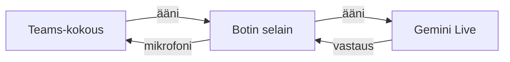

# Gemini-botti palaverissa {fx=starfield fx-density=1.2 fx-hue=228}

Markdownista esitys: teksti, puhe ja animaatio samassa paikassa.
{.lead}

::: notes
Tervetuloa. Tämä esitys on kirjoitettu Markdownina vasemmalla, ja oikealla
näkyy sama esitys EVG:llä piirrettynä.
:::

## Miten botti puhuu palaverissa? {#puhe transition=slide seconds=0.5 fx=starfield fx-density=1.6 fx-hue=228}

1. Liittyy kokoukseen vieraana – kuten kuka tahansa linkin saanut
2. Kuulee kokouksen äänen ja välittää sen Geminille
3. Vastaus soitetaan kokoukseen botin mikrofonina
4. Kamerakuvana animoitu hahmo, joka sykkii puheen tahdissa
{.build anim=rise}

::: notes
Botti liittyy kokoukseen kuten kuka tahansa linkin saanut. [[1]]
Se kuulee äänen ja välittää sen Geminille. [[2]]
Vastaus soitetaan kokoukseen botin mikrofonina. [[3]]
Ja kamerakuvana on hahmo, joka sykkii puheen tahdissa. [[4]]
:::

## Kolme osaa {transition=zoom fx=plasma-wave}

- **Teams-kokous** – ihmiset puhuvat normaalisti
- **Botin selain** – liittyy vieraana, Dockerissa
- **Gemini Live** – kuuntelee ja vastaa äänellä
{.build anim=fly}

## Kulku


{zoom=1.9}

::: notes
Pallo kulkee reitin: kokouksen ääni selaimelle, selaimelta Geminille, ja
vastaus takaisin kokoukseen botin mikrofonina.
:::

## Miten tätä muokataan

- `## Otsikko {transition=slide}` aloittaa dian ja valitsee siirtymän
- `{.build}` listan perässä tuo kohdat yksi kerrallaan
- `{anim=fade|rise|fly|zoom}` lohkon perässä animoi sen
- `fx=starfield`, `plasma-wave`, `smoke`, `ambient-light` otsikossa antaa taustaefektin
- `::: notes` … `:::` on puhujan muistiinpanot
- Kaavio (```mermaid, ```dot) piirretään käsin piirretyn näköisenä ja kierretään pallolla; `{tour=off}`, `{ball=off}`, `{zoom=2}` tai `{diagram=classic}` fencen perässä
- Ctrl+V liittää kuvan leikepöydältä
{.build anim=fade}
