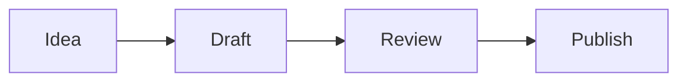

# Characters on slides

A robot walks on what the slide shows and jumps from box to box
{.lead}

## The robot goes round the work {script=apps/flow.tsx}



## The robot walks the list {script=apps/walk.tsx}

- It walks along the first point
- It jumps to the second
- And last onto the heading

## How it is written

```js
sprites.sheet("robot", { src: "sprites/robot.png", grid: [8, 1],
  anims: { walk: { from: 2, frames: 4, fps: 8 } } });
const r = sprites.add("robot", { on: find("node#A") });
r.walkTo(find("node#B")).jump(find("h2")).say("Done!");
```

- The spritesheet is the deck's own file (`sprites/robot.png`)
- `walkTo` walks on one level and hops over the gaps, `jump` jumps straight there
- `say`, `wait`, `face`, `play` and `call` queue up
- Thumbnails and the PDF show where the character ends up
