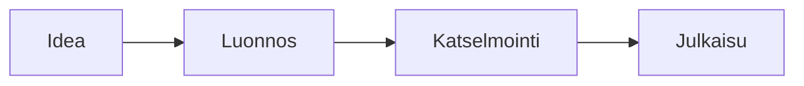

# Hahmot kalvoilla

Robotti kävelee sen päällä, mitä dia näyttää, ja hyppää laatikolta toiselle
{.lead}

## Robotti kiertää työn {script=apps/flow.tsx}



## Robotti kävelee listalla {script=apps/walk.tsx}

- Ensimmäisen kohdan päällä kävellään
- Toiselle hypätään
- Lopuksi otsikolle

## Miten se kirjoitetaan

```js
sprites.sheet("robot", { src: "sprites/robot.png", grid: [8, 1],
  anims: { walk: { from: 2, frames: 4, fps: 8 } } });
const r = sprites.add("robot", { on: find("node#A") });
r.walkTo(find("node#B")).jump(find("h2")).say("Valmis!");
```

- Spritesheet on pakan oma tiedosto (`sprites/robot.png`)
- `walkTo` kävelee samalla tasolla ja hyppää rakojen yli, `jump` hyppää suoraan
- `say`, `wait`, `face`, `play` ja `call` jonoon
- Pikkukuvat ja PDF näyttävät, mihin hahmo päätyy
