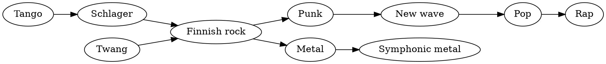

# Decades of Finnish music

From tango to metal – how one small country found many voices.
{.lead}

## Timeline {transition=slide}

| Decade | Movement | Known names |
|---|---|---|
| 1950s | Finnish tango | Olavi Virta |
| 1960s | Schlager and twang | The Sounds, Katri Helena |
| 1970s | Finnish rock | Hurriganes, Juice Leskinen |
| 1980s | Punk and new wave | Eppu Normaali, Dingo |
| 1990s | Metal goes global | Nightwish, HIM |
| 2000s | Pop and rap | Apulanta, Cheek |

::: notes
Every decade brought something new, but the old did not disappear: the tango
festival still fills up every summer.
:::

## A web of influences

::: notes
Influences cross: Finnish rock inherited both twang and schlager and passed
them on to punk and metal.
:::

## Three phenomena

- The Seinäjoki tango festival every summer since 1985
- Schlager lyrics about longing and summer
- The most metal bands per capita in the world
- A Eurovision win in 2006 in monster costumes
- Rap in Finnish tops the charts
- A folk music revival on the kantele
{.c3}

## A quote {transition=zoom}

> Music is what words cannot say.

Every generation writes its own chapter in the same book.
{.kicker}
