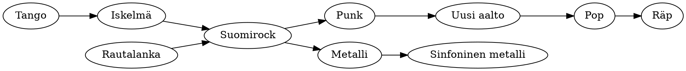

# Suomalaisen musiikin vuosikymmenet

Tangosta metalliin – miten yksi pieni maa löysi monta ääntä.
{.lead}

## Aikajana {transition=slide}

| Vuosikymmen | Ilmiö | Tunnettuja nimiä |
|---|---|---|
| 1950 | Suomalainen tango | Olavi Virta |
| 1960 | Iskelmä ja rautalanka | The Sounds, Katri Helena |
| 1970 | Suomirock | Hurriganes, Juice Leskinen |
| 1980 | Punk ja uusi aalto | Eppu Normaali, Dingo |
| 1990 | Metalli maailmalle | Nightwish, HIM |
| 2000 | Pop ja räp | Apulanta, Cheek |

::: notes
Jokainen vuosikymmen on tuonut jotain uutta, mutta vanha ei ole kadonnut:
tangomarkkinat täyttyvät edelleen joka kesä.
:::

## Vaikutteiden verkko

::: notes
Vaikutteet kulkevat ristiin: suomirock sai sekä rautalangan että iskelmän
perinnön ja antoi ne eteenpäin punkille ja metallille.
:::

## Kolme ilmiötä

- Tangomarkkinat Seinäjoella joka kesä vuodesta 1985
- Iskelmän sanoitukset kertovat kaipuusta ja kesästä
- Metallibändejä asukasta kohden eniten maailmassa
- Eurovisiovoitto 2006 hirviöasuissa
- Räp nousee listojen kärkeen suomeksi
- Kansanmusiikin uusi tuleminen kanteleella
{.c3}

## Lainaus {transition=zoom}

> Musiikki on se, mitä sanat eivät pysty sanomaan.

Jokainen sukupolvi kirjoittaa oman lukunsa samaan kirjaan.
{.kicker}
