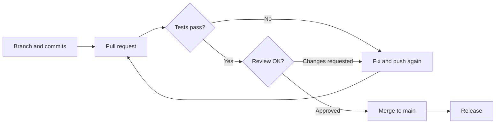

# Version control in a team

Branches, reviews and the one command that saves the day.
{.lead}

## The everyday moves

```bash
git switch -c fix/login
git add -p
git commit -m "Login: show the error message"
git push -u origin fix/login
```

::: notes
Four commands: a new branch, a selective add, a commit and a push. These get
you a long way.
:::

## A change's way to production



::: notes
This diagram has a loop: the tests or the review can send the change back.
Pick a direction, or let the presentation continue.
:::

## A good commit message

1. A subject of at most 50 characters, in the imperative
2. A blank line after the subject
3. The body says **why**, not just what
4. A reference to the ticket or issue
{.build anim=rise}

::: notes
The subject first. [[1]] Then a blank line. [[2]] The body explains the reason. [[3]]
And finally the reference. [[4]]
:::

## Who does what?

| Role | Task | When |
|---|---|---|
| Developer | Branch, commits, pull request | Every change |
| CI | Tests and build | Every push |
| Reviewer | Reads the change and asks | Before the merge |
| Maintainer | Releases and monitors | When main is green |

## The command that saves you {transition=zoom}

```bash
git reflog
```

Almost nothing gets lost: the reflog remembers where HEAD has been.
{.lead}
