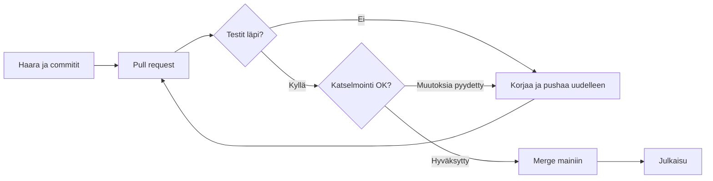

# Versionhallinta tiimissä

Haarat, katselmoinnit ja se yksi komento, joka pelastaa päivän.
{.lead}

## Päivän perusliikkeet

```bash
git switch -c korjaus/kirjautuminen
git add -p
git commit -m "Kirjautuminen: virheilmoitus näkyviin"
git push -u origin korjaus/kirjautuminen
```

::: notes
Neljä komentoa: uusi haara, valikoiva lisäys, commit ja push. Näillä pääsee
pitkälle.
:::

## Muutoksen matka tuotantoon



::: notes
Tässä kaaviossa on silmukka: testit tai katselmointi voivat palauttaa
muutoksen takaisin. Valitse suunta, tai anna esityksen jatkaa.
:::

## Hyvä commit-viesti

1. Otsikko enintään 50 merkkiä, käskymuodossa
2. Tyhjä rivi otsikon jälkeen
3. Runko kertoo **miksi**, ei vain mitä
4. Viittaus tikettiin tai issueen
{.build anim=rise}

::: notes
Otsikko ensin. [[1]] Sitten tyhjä rivi. [[2]] Runko selittää syyn. [[3]]
Ja lopuksi viittaus. [[4]]
:::

## Kuka tekee mitä?

| Rooli | Tehtävä | Milloin |
|---|---|---|
| Kehittäjä | Haara, commitit, pull request | Joka muutoksessa |
| CI | Testit ja käännös | Jokaisesta pushista |
| Katselmoija | Lukee muutoksen ja kysyy | Ennen mergeä |
| Ylläpitäjä | Julkaisee ja seuraa | Kun main on vihreä |

## Pelastava komento {transition=zoom}

```bash
git reflog
```

Melkein mikään ei katoa: reflog muistaa, missä HEAD on ollut.
{.lead}
