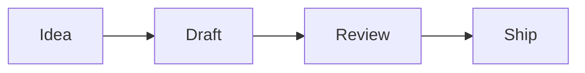

# Slides that move

A script moves what the slide already shows: its headings, words, bars and diagram nodes
{.lead}

## Bars that grow one by one {script=apps/grow.tsx}

```vega-lite
{"data":{"values":[{"q":"Q1","sales":42},{"q":"Q2","sales":55},{"q":"Q3","sales":61},{"q":"Q4","sales":78}]},"mark":"bar","encoding":{"x":{"field":"q","type":"nominal","title":null},"y":{"field":"sales","type":"quantitative","title":"Sales"}}}
```

- Every quarter better than the last
- The fourth the best so far

## Words that arrive {script=apps/words.tsx}

Every word of this sentence finds its own way into place
{.lead}

The script finds `p.lead word` and sets each one's `y` and `opacity`.

## The work goes round {script=apps/flow.tsx}



## The total

Sales this year
{#label}

€ 1.2 M
{#total .lead}

## The total {transition=morph seconds=1}

€ 1.2 M
{#total}

- North € 0.5 M
- South € 0.4 M
- East € 0.3 M

Sales this year
{#label}

## Click an item {script=apps/pick.tsx}

- Click one of these while presenting
- It comes forward, the others step back
- Leaving the slide fades the list

## How it is written

```markdown
## Bars that grow {script=apps/grow.tsx export-frame=2s}
## The total {transition=morph}
```

- `find("chart:1 bar")`, `find("p word")`, `find("diagram node")`: the slide's own entities
- `e.set({ x, y, scale, rotate, opacity, color, fill, clip })` in `tick(dt)`, `build(n)` or `onClick(e)`
- `transition=morph`: the same `{#id}` on two slides moves to its new place
- Thumbnails, the PDF, the PPTX and the shared link show where each script ends
