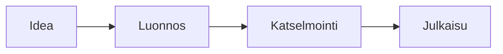

# Diat, jotka liikkuvat

Skripti liikuttaa sitä, mitä dia jo näyttää: otsikoita, sanoja, pylväitä ja kaavion solmuja
{.lead}

## Pylväät kasvavat yksi kerrallaan {script=apps/grow.tsx}

```vega-lite
{"data":{"values":[{"q":"Q1","myynti":42},{"q":"Q2","myynti":55},{"q":"Q3","myynti":61},{"q":"Q4","myynti":78}]},"mark":"bar","encoding":{"x":{"field":"q","type":"nominal","title":null},"y":{"field":"myynti","type":"quantitative","title":"Myynti"}}}
```

- Jokainen neljännes edellistä parempi
- Neljäs tähän asti paras

## Sanat saapuvat {script=apps/words.tsx}

Tämän lauseen jokainen sana löytää paikkansa omaa reittiään
{.lead}

Skripti hakee `p.lead word` ja asettaa jokaiselle `y`:n ja `opacity`n.

## Työ kiertää {script=apps/flow.tsx}



## Kokonaismyynti

Myynti tänä vuonna
{#label}

1,2 M€
{#total .lead}

## Kokonaismyynti {transition=morph seconds=1}

1,2 M€
{#total}

- Pohjoinen 0,5 M€
- Etelä 0,4 M€
- Itä 0,3 M€

Myynti tänä vuonna
{#label}

## Napsauta kohtaa {script=apps/pick.tsx}

- Napsauta jotakin näistä esittäessäsi
- Se nousee esiin, muut väistyvät
- Diasta lähtiessä lista himmenee

## Miten se kirjoitetaan

```markdown
## Pylväät kasvavat {script=apps/grow.tsx export-frame=2s}
## Kokonaismyynti {transition=morph}
```

- `find("chart:1 bar")`, `find("p word")`, `find("diagram node")`: dian omat entiteetit
- `e.set({ x, y, scale, rotate, opacity, color, fill, clip })` funktioissa `tick(dt)`, `build(n)` tai `onClick(e)`
- `transition=morph`: sama `{#id}` kahdella dialla siirtyy uuteen paikkaansa
- Pikkukuvat, PDF, PPTX ja jaettu linkki näyttävät, mihin kukin skripti päättyy
