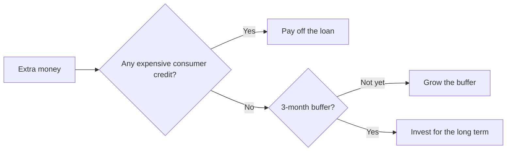

# Take charge of your money

A budget, a buffer and compound interest – three things that go a long way.
{.lead}

::: notes
Welcome. Let's go through three basics: where the money goes, why the buffer
comes first and how time makes saving easy.
:::

## Where does the money go? {transition=slide}

```vega-lite
{
  "data": {"values": [
    {"expense": "Housing", "share": 32},
    {"expense": "Food", "share": 14},
    {"expense": "Transport", "share": 12},
    {"expense": "Leisure", "share": 10},
    {"expense": "Other", "share": 17},
    {"expense": "Savings", "share": 15}
  ]},
  "width": 640,
  "height": 250,
  "background": "rgba(0,0,0,0)",
  "mark": "bar",
  "encoding": {
    "x": {"field": "expense", "type": "nominal", "sort": null, "title": null},
    "y": {"field": "share", "type": "quantitative", "title": "% of net income"}
  }
}
```

::: notes
A typical split: housing takes about a third. Savings are the share you can
influence the most yourself.
:::

## Three rules

1. Pay yourself first – savings move on payday
2. A buffer before investing: three months of expenses
3. Keep spending visible: no surprises at the end of the month
{.build anim=rise}

::: notes
Savings first, then everything else. [[1]]
The buffer protects you from surprises. [[2]]
And once you can see your spending, you can change it. [[3]]
:::

## Where does the next euro go?



::: notes
Let's stop at the choice: what to do with extra money? The audience gets to pick.
:::

## Compound interest {transition=zoom}

| Monthly saving | 10 years | 20 years | 30 years |
|---|---:|---:|---:|
| €50 | €7,800 | €23,000 | €50,000 |
| €100 | €15,500 | €46,000 | €100,000 |
| €200 | €31,000 | €92,000 | €200,000 |

At a 5% annual return, rounded: $FV = PMT \cdot \frac{(1+r)^n - 1}{r}$
{.kicker}

::: notes
The same monthly amount, a different time span: in thirty years the returns
are already larger than the amount saved.
:::

## Checklist

- [x] A monthly budget on paper
- [x] Automatic savings
- [ ] A buffer for three months of expenses
- [ ] The first investment
{.build anim=fade}
