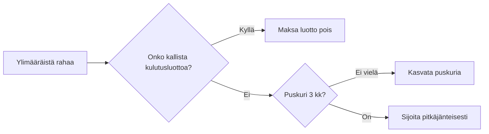

# Oma talous haltuun

Budjetti, puskuri ja korkoa korolle – kolme asiaa, jotka kantavat pitkälle.
{.lead}

::: notes
Tervetuloa. Käydään läpi kolme perusasiaa: mihin raha menee, miksi puskuri
tulee ensin ja miten aika tekee säästämisestä helppoa.
:::

## Mihin raha menee? {transition=slide}

```vega-lite
{
  "data": {"values": [
    {"kulu": "Asuminen", "osuus": 32},
    {"kulu": "Ruoka", "osuus": 14},
    {"kulu": "Liikenne", "osuus": 12},
    {"kulu": "Vapaa-aika", "osuus": 10},
    {"kulu": "Muut", "osuus": 17},
    {"kulu": "Säästöt", "osuus": 15}
  ]},
  "width": 640,
  "height": 250,
  "background": "rgba(0,0,0,0)",
  "config": {
    "axis": {"labelColor": "#c8d0ff", "titleColor": "#c8d0ff", "gridColor": "#2d3a7a", "domainColor": "#56608f", "tickColor": "#56608f", "labelFontSize": 13, "titleFontSize": 13},
    "view": {"stroke": null}
  },
  "mark": {"type": "bar", "color": "#5ce1ff", "cornerRadiusTopLeft": 3, "cornerRadiusTopRight": 3},
  "encoding": {
    "x": {"field": "kulu", "type": "nominal", "sort": null, "title": null},
    "y": {"field": "osuus", "type": "quantitative", "title": "% nettotuloista"}
  }
}
```

::: notes
Tyypillinen jakauma: asuminen vie noin kolmanneksen. Säästöjen osuus on se,
johon voi itse vaikuttaa eniten.
:::

## Kolme sääntöä

1. Maksa ensin itsellesi – säästö siirtyy palkkapäivänä
2. Puskuri ennen sijoituksia: kolmen kuukauden menot
3. Kulut näkyviin: kuukauden lopussa ei yllätyksiä
{.build anim=rise}

::: notes
Ensin säästö, sitten muu elämä. [[1]]
Puskuri suojaa yllätyksiltä. [[2]]
Ja kun kulut näkyvät, niihin voi vaikuttaa. [[3]]
:::

## Mihin seuraava euro?



::: notes
Pysähdytään valintaan: mitä tehdä ylimääräisellä rahalla? Yleisö saa valita.
:::

## Korkoa korolle {transition=zoom}

| Kuukausisäästö | 10 vuotta | 20 vuotta | 30 vuotta |
|---|---:|---:|---:|
| 50 € | 7 800 € | 23 000 € | 50 000 € |
| 100 € | 15 500 € | 46 000 € | 100 000 € |
| 200 € | 31 000 € | 92 000 € | 200 000 € |

Laskettu 5 % vuosituotolla, pyöristetty.
{.kicker}

::: notes
Sama säästösumma, eri aika: kolmessakymmenessä vuodessa tuotto on jo
suurempi kuin itse säästetty summa.
:::

## Muistilista

- [x] Kuukausibudjetti paperille
- [x] Säästö automaattiseksi
- [ ] Puskuri kolmen kuukauden menoihin
- [ ] Ensimmäinen sijoitus
{.build anim=fade}
