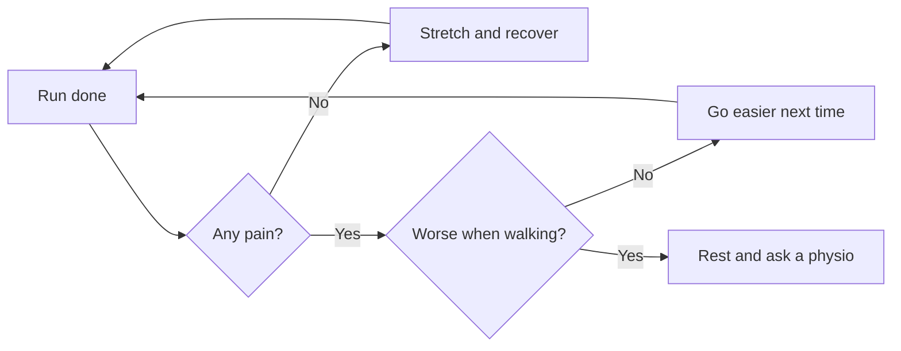

# Five kilometres in eight weeks

A running course for beginners: from walking to running without a break.
{.lead}

::: notes
This programme suits anyone who can walk for half an hour.
:::

## Week by week

| Week | Session (3 × a week) | Total |
|---|---|---:|
| 1–2 | 1 min run, 2 min walk × 8 | 24 min |
| 3–4 | 3 min run, 2 min walk × 5 | 25 min |
| 5–6 | 8 min run, 2 min walk × 3 | 30 min |
| 7 | 15 min run, 3 min walk × 2 | 36 min |
| 8 | 5 km without a break | ~35 min |

## Heart rate zones

1. **Recovery** – you can talk in full sentences
2. **Base endurance** – you can talk in short sentences
3. **Tempo** – only a few words at a time
4. **Maximum** – you cannot talk
{.build anim=rise}

::: notes
Most training happens in the first two zones. [[1]] [[2]]
The third and fourth zones come in only later. [[3]] [[4]]
:::

## After the run

::: notes
The diagram is a loop: run, assess, run again. The presenter can pick the
direction, or if nobody picks, the presentation continues after eight seconds.
:::

## Gear

- Running shoes fitted to your own feet
- A technical shirt, not cotton
- A reflector for dark autumn evenings
- A heart rate monitor, if you want to follow the zones
- A water bottle for longer runs
- A good playlist
{.c2}

## The goal {transition=zoom}

In week 8 you run five kilometres without stopping.
{.lead}

What matters is not the pace but that all three sessions get done.
