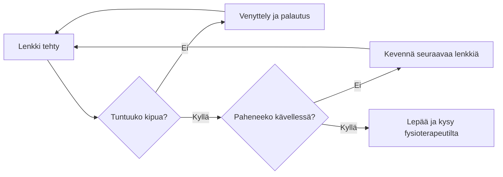

# Viisi kilometriä kahdeksassa viikossa

Juoksukoulu aloittelijalle: kävelystä yhtäjaksoiseen juoksuun.
{.lead}

::: notes
Tämä ohjelma sopii kenelle tahansa, joka pystyy kävelemään puoli tuntia.
:::

## Viikko viikolta

| Viikko | Harjoitus (3 × viikossa) | Yhteensä |
|---|---|---:|
| 1–2 | 1 min juoksu, 2 min kävely × 8 | 24 min |
| 3–4 | 3 min juoksu, 2 min kävely × 5 | 25 min |
| 5–6 | 8 min juoksu, 2 min kävely × 3 | 30 min |
| 7 | 15 min juoksu, 3 min kävely × 2 | 36 min |
| 8 | 5 km yhtäjaksoisesti | ~35 min |

## Sykealueet

1. **Palauttava** – puhe sujuu kokonaisina lauseina
2. **Peruskestävyys** – puhe onnistuu lyhyinä lauseina
3. **Vauhtikestävyys** – vain muutama sana kerrallaan
4. **Maksimi** – puhe ei onnistu
{.build anim=rise}

::: notes
Suurin osa harjoittelusta tehdään kahdella ensimmäisellä alueella. [[1]] [[2]]
Kolmas ja neljäs alue tulevat mukaan vasta myöhemmin. [[3]] [[4]]
:::

## Juoksun jälkeen

::: notes
Kaavio on silmukka: lenkki, arvio, uusi lenkki. Esittäjä voi valita
suunnan, tai jos kukaan ei valitse, esitys jatkuu kahdeksan sekunnin päästä.
:::

## Varusteet

- Juoksukengät, jotka on sovitettu omaan jalkaan
- Tekninen paita, ei puuvillaa
- Heijastin syksyn pimeään
- Sykemittari, jos haluaa seurata sykealueita
- Juomapullo pidemmille lenkeille
- Hyvä soittolista
{.c2}

## Tavoite {transition=zoom}

Viikolla 8 juokset viisi kilometriä pysähtymättä.
{.lead}

Tärkeintä ei ole vauhti vaan se, että jokainen kolmesta harjoituksesta tulee tehtyä.
