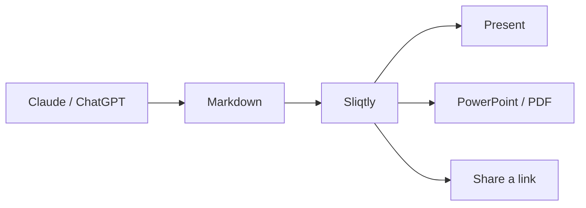

# Sliqtly Better Slides {fx=smoke}

Beautiful slides from Markdown — with PPTX & PDF export, Excel data sources, and fully customizable themes.
{.lead}

::: notes
This deck is a Sliqtly presentation. The text on the left is the whole deck,
the slides on the right are drawn from it as you type.
:::

## Why Sliqtly {transition=slide}

- **Markdown in, beautiful slides out**
- **PowerPoint and PDF** export in one click
- **Excel and Google Sheets** as data for charts and tables
- **Your own look:** themes and CSS styles
{.build anim=rise}

::: notes
You write text, Sliqtly draws the slides. [[1]]
They go out as PowerPoint or PDF whenever you need a file. [[2]]
Charts and tables read your spreadsheets. [[3]]
And the look is yours to change. [[4]]
:::

## Just write

```markdown
## Results {transition=slide}

1. Revenue up 12 %
2. Two new markets
{.build anim=rise}
```

`#` is the title slide, every `##` starts a new one, `{…}` adds the motion.
{.kicker}

::: notes
Edit any line on the left and watch this slide change.
:::

## Your Excel data, as a chart

```vega-lite
{
  "data": {"values": [
    {"quarter": "Q1", "revenue": 3.1},
    {"quarter": "Q2", "revenue": 3.8},
    {"quarter": "Q3", "revenue": 4.6},
    {"quarter": "Q4", "revenue": 5.9}
  ]},
  "width": 600,
  "height": 210,
  "background": "rgba(0,0,0,0)",
  "mark": "bar",
  "encoding": {
    "x": {"field": "quarter", "type": "nominal", "title": null, "axis": {"labelAngle": 0}},
    "y": {"field": "revenue", "type": "quantitative", "title": "Revenue, M€"}
  }
}
```

Add an Excel workbook or paste a table, and Sliqtly suggests the chart.
{.kicker}

::: notes
Charts are Vega-Lite, so bars, lines, areas, pies and maps all work.
Click the vega-lite line on the left to edit the chart in a form instead of JSON.
:::

## Live data

- Point a chart or a table at a **Google Sheet**, a CSV or a JSON link
- The numbers are read again every time the deck opens
- Press **R** during the show to refresh
- Exports keep a snapshot of the data as it was
{.build anim=fly}

```markdown
"data": {"source": "google-sheets", "id": "<sheet link>", "range": "A:B"}
```

::: notes
Paste a Google Sheet link into the editor and Sliqtly offers to link it as
live data. Live data is a PRO feature.
:::

## PowerPoint, PDF or a link

1. **Share** gives a link that opens straight into the show, on any screen
2. **Export** makes a PowerPoint, a PDF or the Markdown file
3. With **PRO** your decks live in the cloud and follow you to every device
{.build anim=rise}

::: notes
The shared link plays with animations and live data. [[1]]
The exports are for when the deck has to travel as a file. [[2]]
PRO keeps every deck in your account. [[3]]
:::

## Your own style {transition=slide}

```css
h2 { color: #ffa546; }
chart { chart-style: neon; }
```

Seven themes, light and dark, and any of them changed in the **Theme (CSS)** tab.
{.kicker}

::: notes
Pick a theme from the toolbar, then change colours, fonts and the chart style
with a few lines of CSS.
:::

## Tables {transition=zoom}

| Format | Opens in | Keeps |
|---|---|---|
| PowerPoint (.pptx) | PowerPoint, Keynote, Google Slides | Text you can edit, real equations |
| PDF | Any reader | Every slide as drawn |
| Link | Any browser or phone | Animations, live data |
| Markdown | Any editor | The source itself |

Workbooks too: a `table` block pages through an Excel sheet, a CSV or a Google Sheet.
{.kicker}

## Diagrams that tell a story



::: notes
Mermaid, Graphviz, D2 and PlantUML diagrams are animated as a guided tour,
one box at a time.
:::

## Formulas

$$
FV = PMT \cdot \frac{(1+r)^n - 1}{r}
$$

Write TeX: `$…$` inline, `$$…$$` on its own line. In PowerPoint it becomes a real equation.
{.kicker}

## Edit with Claude or ChatGPT

- **File → Edit in Claude…** hands this deck to your assistant
- Connect Sliqtly to Claude, ChatGPT or Cursor: **sliqtly.com/connect.html**
- Then just ask: *"Make a six-slide deck from this spreadsheet"*
- The assistant writes the slides and gives you the link
{.build anim=fade}

## Headers, footers and page numbers

```markdown
footer-left: sliqtly.com
footer-right: "{page} / {pages}"
footer-skip: first last
```

That is the footer on these slides, written in the deck's front matter.
{.kicker}

## Start your own deck {fx=smoke}

1. **File → New presentation** gives you a clean deck
2. Or pick a sample from the menu and change it
3. Or edit this one: it is yours now
{.build anim=rise}

Press **Present** to see the show full screen.
{.kicker}

::: notes
That's it. Start with a heading and a few lines, and the slides follow.
:::
