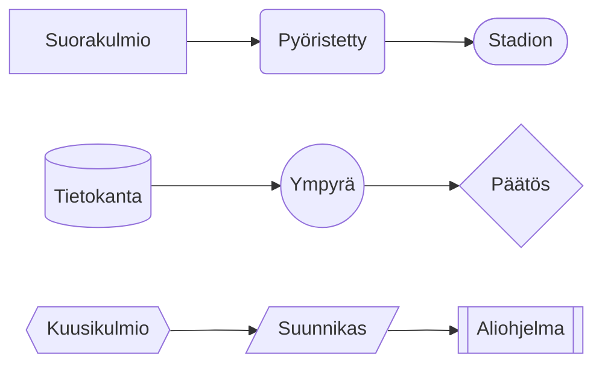
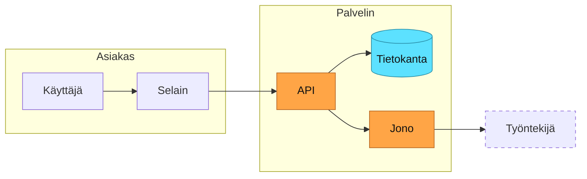
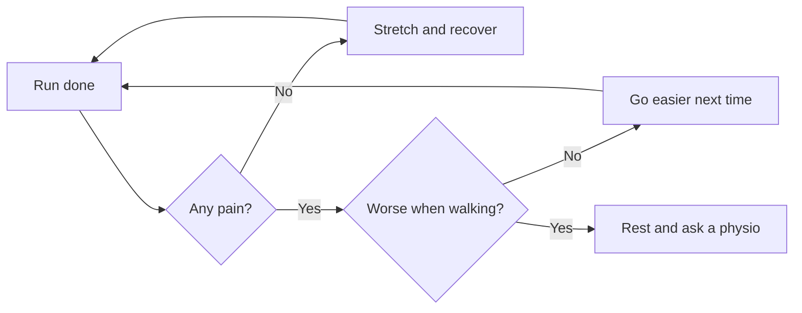

# Sliqtly {bg=media/bg.png fx=raindrops2}


{width=100% height=100%}

## Julkaisuprosessi



## Myynti alueittain

```vega-lite
{"$schema": "https://vega.github.io/schema/vega-lite/v5.json", "background": "rgba(0,0,0,0)", "config": {"axis": {"labelColor": "#c8d0f0", "titleColor": "#c8d0f0", "gridColor": "#2d3a7a", "domainColor": "#5c6aa8", "tickColor": "#5c6aa8", "labelFontSize": 14}, "legend": {"labelColor": "#c8d0f0", "labelFontSize": 14}, "view": {"stroke": null}}, "width": 820, "height": 320, "data": {"values": [{"q": "Q1", "alue": "Etelä", "k": 460}, {"q": "Q1", "alue": "Länsi", "k": 384}, {"q": "Q1", "alue": "Itä", "k": 280}, {"q": "Q1", "alue": "Pohjoinen", "k": 268}, {"q": "Q2", "alue": "Etelä", "k": 512}, {"q": "Q2", "alue": "Länsi", "k": 434}, {"q": "Q2", "alue": "Itä", "k": 344}, {"q": "Q2", "alue": "Pohjoinen", "k": 312}, {"q": "Q3", "alue": "Etelä", "k": 539}, {"q": "Q3", "alue": "Länsi", "k": 457}, {"q": "Q3", "alue": "Itä", "k": 379}, {"q": "Q3", "alue": "Pohjoinen", "k": 313}, {"q": "Q4", "alue": "Etelä", "k": 604}, {"q": "Q4", "alue": "Länsi", "k": 502}, {"q": "Q4", "alue": "Itä", "k": 416}, {"q": "Q4", "alue": "Pohjoinen", "k": 315}]}, "mark": {"type": "bar", "cornerRadiusEnd": 3}, "encoding": {"x": {"field": "q", "type": "ordinal", "title": null, "axis": {"labelAngle": 0}}, "xOffset": {"field": "alue"}, "y": {"field": "k", "type": "quantitative", "title": "k€"}, "color": {"field": "alue", "type": "nominal", "title": null, "legend": {"orient": "top"}}, "tooltip": [{"field": "alue"}, {"field": "q"}, {"field": "k"}]}}
```

## Yksi lähde, monta muotoa


{layout=radial1 colors=colorful1}

## Tiekartta

```timeline
- Q1: Markdown-editori
- Q2: Kaaviot ja vuokaaviot
- Q3: MCP-palvelin
- Q4: Yrityspalvelin
```

## Arkkitehtuuri



## Math Symbols

$$f'(x) = \lim_{h \to 0} \frac{f(x+h) - f(x)}{h}$$

$$\int_0^\infty e^{-x^2}\,dx = \frac{\sqrt{\pi}}{2}$$

# Layouts and line art {art=waves}

- Plan: goals, budget and schedule
- Build: code, content and tests
- Pilot: ten customers try it
- Launch: open to everyone
{list-style=process}

{.lead}

::: notes
The line art is a PRO feature; the layouts are free. Every layout below is computed from the text and the room on the slide; change the theme and they change colour with it.
:::


## Code and Syntax

```typescript
const deck = await sliqtly.create({
  title: "Kvartaalikatsaus",
  theme: "aurora",
  markdown: "# Q4\n\n## Myynti\n...",
});
console.log(deck.share_url);
```

## Effects { fx=starfield }



