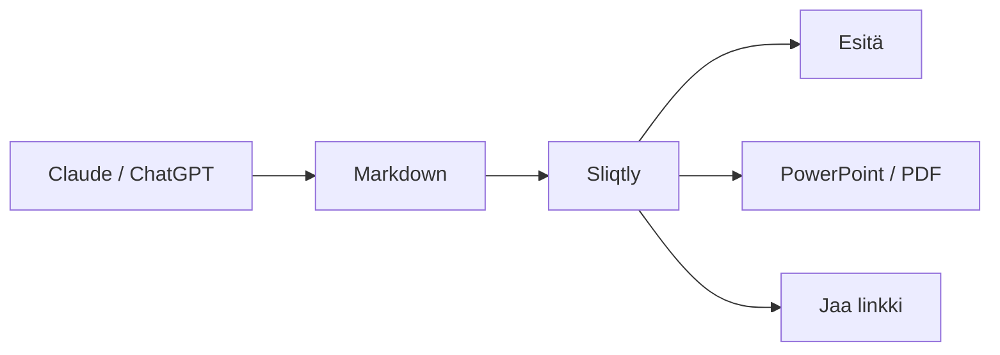

# Sliqtly Better Slides {fx=starfield fx-density=1.2 fx-hue=228}

Näyttävät diat Markdownista — PPTX- ja PDF-viennillä, Excel-datalähteillä ja täysin muokattavilla teemoilla.
{.lead}

::: notes
Tämä esitys on Sliqtly-esitys. Vasemmalla oleva teksti on koko esitys,
oikealla olevat diat piirretään siitä sitä mukaa kuin kirjoitat.
:::

## Miksi Sliqtly {transition=slide}

- **Markdownista näyttävät diat**
- **PowerPoint ja PDF** yhdellä napautuksella
- **Excel ja Google Sheets** kaavioiden ja taulukoiden datana
- **Oma ilme:** teemat ja CSS-tyylit
{.build anim=rise}

::: notes
Sinä kirjoitat tekstiä, Sliqtly piirtää diat. [[1]]
Ne lähtevät PowerPointina tai PDF:nä aina kun tarvitset tiedoston. [[2]]
Kaaviot ja taulukot lukevat taulukkosi. [[3]]
Ja ilmeen saat muuttaa omaksesi. [[4]]
:::

## Kirjoita vain

```markdown
## Tulokset {transition=slide}

1. Liikevaihto kasvoi 12 %
2. Kaksi uutta markkinaa
{.build anim=rise}
```

`#` on kansidia, jokainen `##` aloittaa uuden, `{…}` lisää liikkeen.
{.kicker}

::: notes
Muuta mitä tahansa riviä vasemmalla ja katso, miten dia muuttuu.
:::

## Excel-datasi kaaviona

```vega-lite
{
  "data": {"values": [
    {"quarter": "Q1", "revenue": 3.1},
    {"quarter": "Q2", "revenue": 3.8},
    {"quarter": "Q3", "revenue": 4.6},
    {"quarter": "Q4", "revenue": 5.9}
  ]},
  "width": 600,
  "height": 210,
  "background": "rgba(0,0,0,0)",
  "mark": "bar",
  "encoding": {
    "x": {"field": "quarter", "type": "nominal", "title": null, "axis": {"labelAngle": 0}},
    "y": {"field": "revenue", "type": "quantitative", "title": "Liikevaihto, M€"}
  }
}
```

Lisää Excel-työkirja tai liitä taulukko, niin Sliqtly ehdottaa kaaviota.
{.kicker}

::: notes
Kaaviot ovat Vega-Liteä, joten pylväät, viivat, alueet, piiraat ja kartat toimivat.
Napsauta vasemmalla vega-lite-riviä, niin voit muokata kaaviota lomakkeella.
:::

## Live-data

- Kaavio tai taulukko voi lukea **Google Sheetsin**, CSV- tai JSON-linkin
- Luvut luetaan uudelleen aina, kun esitys avataan
- Paina esityksen aikana **R** päivittääksesi
- Viedyt tiedostot säilyttävät datan sellaisena kuin se oli
{.build anim=fly}

```markdown
"data": {"source": "google-sheets", "id": "<taulukon linkki>", "range": "A:B"}
```

::: notes
Liitä Google Sheets -linkki editoriin, niin Sliqtly tarjoaa sitä live-datana.
Live-data on PRO-ominaisuus.
:::

## PowerPoint, PDF tai linkki

1. **Jaa** antaa linkin, joka avautuu suoraan esitykseen millä tahansa näytöllä
2. **Vie** tekee PowerPointin, PDF:n tai Markdown-tiedoston
3. **PRO**:lla esityksesi ovat pilvessä ja seuraavat sinua joka laitteelle
{.build anim=rise}

::: notes
Jaettu linkki toistaa animaatiot ja live-datan. [[1]]
Viedyt tiedostot ovat sitä varten, kun esityksen pitää kulkea tiedostona. [[2]]
PRO pitää jokaisen esityksen tililläsi. [[3]]
:::

## Oma tyyli {transition=slide}

```css
h2 { color: #ffa546; }
chart { chart-style: neon; }
```

Seitsemän teemaa, vaaleita ja tummia, ja mitä tahansa voi muuttaa **Teema (CSS)** -välilehdellä.
{.kicker}

::: notes
Valitse teema työkalupalkista ja muuta värejä, fontteja ja kaavioiden tyyliä
muutamalla CSS-rivillä.
:::

## Taulukot {transition=zoom}

| Muoto | Avautuu | Säilyttää |
|---|---|---|
| PowerPoint (.pptx) | PowerPoint, Keynote, Google Slides | Muokattavan tekstin, oikeat kaavat |
| PDF | Mikä tahansa lukija | Jokaisen dian sellaisenaan |
| Linkki | Mikä tahansa selain tai puhelin | Animaatiot, live-datan |
| Markdown | Mikä tahansa editori | Itse lähdetekstin |

Myös työkirjat: `table`-lohko selaa Excel-taulukkoa, CSV:tä tai Google Sheetsiä.
{.kicker}

## Kaaviokuvat, jotka kertovat tarinan



::: notes
Mermaid-, Graphviz-, D2- ja PlantUML-kaaviot animoidaan opastettuna kierroksena
laatikko kerrallaan.
:::

## Kaavat

$$
FV = PMT \cdot \frac{(1+r)^n - 1}{r}
$$

Kirjoita TeXiä: `$…$` tekstin sisällä, `$$…$$` omalla rivillään. PowerPointissa siitä tulee oikea kaava.
{.kicker}

## Muokkaa Clauden tai ChatGPT:n kanssa

- **Tiedosto → Muokkaa Claudessa…** antaa esityksen avustajallesi
- Yhdistä Sliqtly Claudeen, ChatGPT:hen tai Cursoriin: **sliqtly.com/connect.html**
- Pyydä sitten: *"Tee tästä taulukosta kuuden dian esitys"*
- Avustaja kirjoittaa diat ja antaa sinulle linkin
{.build anim=fade}

## Ylä- ja alaosat sekä sivunumerot

```markdown
footer-left: sliqtly.com
footer-right: "{page} / {pages}"
footer-skip: first last
```

Näiden diojen alaosa on kirjoitettu esityksen alkuun näin.
{.kicker}

## Aloita oma esityksesi {fx=starfield fx-density=1.2 fx-hue=228}

1. **Tiedosto → Uusi esitys** antaa tyhjän esityksen
2. Tai valitse valikosta esimerkki ja muokkaa sitä
3. Tai muokkaa tätä: se on nyt sinun
{.build anim=rise}

Paina **Esitä** nähdäksesi esityksen koko näytöllä.
{.kicker}

::: notes
Siinä kaikki. Aloita otsikolla ja parilla rivillä, ja diat seuraavat.
:::
