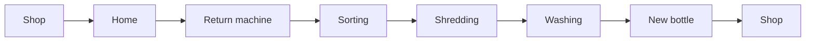

# Your everyday carbon footprint

The average footprint in Finland is about 10 tonnes a year. Where does it come from?
{.lead}

## Four big sources {transition=slide}

| Source | Share | Biggest single factor |
|---|---:|---|
| Housing | 30% | Heating and electricity |
| Transport | 26% | Your own car and flights |
| Food | 18% | Red meat and dairy |
| Goods and services | 26% | Clothes and electronics |

::: notes
Four sources of fairly equal size. No single change solves it, but each one
has one clear lever.
:::

## A bottle's journey

::: notes
Over 90 percent of deposit plastic bottles in Finland come back. The chain is
long, and the diagram wraps automatically so that it fits the slide.
:::

## What can I do?

- **Housing** – one degree cooler indoors, a green electricity contract
- **Transport** – short trips by bike, the train instead of a flight
- **Food** – vegetarian meals on more days of the week
- **Goods** – repair, borrow, buy second-hand
{.build anim=rise}

::: notes
One thing from each source. [[1]] [[2]] [[3]] [[4]]
:::

## In two columns

- One degree cooler indoors
- Green electricity
- A bike for trips under 5 km
- The train instead of a flight
- Vegetarian food 3 days a week
- Half the food waste
- Second-hand clothes
- Keep your phone two years longer
{.c2}

## Finally {transition=zoom}

> We do not inherit the earth from our ancestors; we borrow it from our children.

Even small changes add up when many people make them.
{.kicker}
