<!--
The 3-D flight's benchmark (src/PresFlightBench.rgr, `npm run bench:flight`):
one case per thing the 2-D slide renderer draws. Each case is a deck of its
own; its LAST slide is measured. A case's line:

  case: <id> | <group> | <what it is> | needs: <what the 2-D slide must show> | files: <pictures>

`needs` keeps the catalogue honest: a case whose 2-D slide does not show
what it names is reported as broken, not as missing in 3-D.
  ent:<kind>   an entity of that kind (h1 h2 p li quote code table image
               chart diagram figure math app html header footer)
  cmd:<kind>   a draw command (text rect border image path stroke)
  bold italic  a text run drawn so
  steps        build steps on the slide
  effect       an effect (fx=, a block's {fx=}, an own ```fx)
  bg           a picture behind the slide
  layout       blocks side by side or placed (their places are measured)
  paper        the slide's own background (theme paper, art, bands)
-->

<!-- case: title-slide | Text | Title slide (#) | needs: ent:h1 paper -->
# Kesäinen Tampere

<!-- case: slide-heading | Text | Slide heading (##) | needs: ent:h2 -->
## Pyynikki ja Pispala

<!-- case: paragraph | Text | Paragraph | needs: ent:p -->
## Kappale

Järviä, harjumaisemia ja todella hyviä kahvitaukoja koko kesän ajan.

<!-- case: lead | Text | Lead line {.lead} | needs: ent:p -->
## Johdanto

Järviä, harjumaisemia, saunoja ja kahvitaukoja.
{.lead}

<!-- case: kicker | Text | Kicker {.kicker} | needs: ent:p -->
## Pikaopas

**48 tunnissa ehdit nähdä klassikot.**
{.kicker}

<!-- case: align-center | Text | Centred lines {.center} | needs: ent:p layout -->
## Keskellä

Tämä rivi on keskellä.
{.center}

<!-- case: align-right | Text | Right-aligned lines {.right} | needs: ent:p layout -->
## Oikealla

Tämä rivi on oikealla.
{.right}

<!-- case: bold | Text | Bold | needs: bold -->
## Lihavointi

Tämä on **tärkeä** asia.

<!-- case: italic | Text | Italic | needs: italic -->
## Kursiivi

Tämä on *korostettu* sana.

<!-- case: strike-underline | Text | Strike-through and underline | needs: ent:p -->
## Viivat

Hinta ~~40 €~~ nyt 30 € ja <u>alleviivattu</u> ehto.

<!-- case: inline-code | Text | Inline code | needs: cmd:rect -->
## Koodi rivillä

Kutsu `sum(rows)` laskee rivit.

<!-- case: link | Text | Link | needs: ent:p -->
## Linkki

Lue lisää [Visit Tampere](https://visittampere.fi) -sivulta.

<!-- case: mark | Text | Highlight <mark> | needs: ent:p -->
## Korostus

Muista <mark>varata sauna</mark> ajoissa.

<!-- case: sub-sup | Text | Sub- and superscript | needs: ent:p -->
## Kaavat tekstissä

Vesi on H<sub>2</sub>O ja pinta-ala m<sup>2</sup>.

<!-- case: span-colour | Text | Coloured span | needs: ent:p -->
## Värit

Tila: <span style="color:#e11d48">myöhässä</span> ja <span style="color:#16a34a">valmis</span>.

<!-- case: span-size | Text | Font size span | needs: ent:p -->
## Koot

Pieni ja <span style="font-size:200%">ISO</span> sana.

<!-- case: kbd | Text | Keyboard keys <kbd> | needs: ent:p -->
## Näppäimet

Paina <kbd>Ctrl</kbd> + <kbd>S</kbd> tallentaaksesi.

<!-- case: emoji | Text | Emoji | needs: ent:p -->
## Emojit

🌿 Pyynikki 🚤 Järvi ♨️ Sauna

<!-- case: entities | Text | HTML entities | needs: ent:p -->
## Merkit

&copy; 2026 Tampere &amp; Pirkanmaa &#8364;

<!-- case: math-inline | Text | Inline math $…$ | needs: ent:p -->
## Kaava rivillä

Pinta-ala on $\pi r^2$ ympyrälle.

<!-- case: math-block | Text | Display math $$…$$ | needs: ent:math -->
## Kaava

$$
E = mc^2
$$

<!-- case: bullets | Lists | Bullet list | needs: ent:li -->
## Luettelo

- Pyynikki
- Pispala
- Näsinneula

<!-- case: numbered | Lists | Numbered list | needs: ent:li -->
## Numeroitu

1. Nouse näkötornille
2. Kävele harjua
3. Saunaan

<!-- case: nested | Lists | Nested list | needs: ent:li -->
## Sisäkkäin

- Kahvilat
  - Pyynikin munkki
  - Tallipiha
- Ravintolat

<!-- case: checklist | Lists | Checklist | needs: ent:li -->
## Muistilista

- [x] Liput
- [ ] Sauna
- [ ] Risteily

<!-- case: list-columns | Lists | List in two columns {.c2} | needs: ent:li layout -->
## Kahdessa sarakkeessa

- Yksi
- Kaksi
- Kolme
- Neljä
- Viisi
- Kuusi
{.c2}

<!-- case: html-list | Lists | HTML list | needs: ent:html -->
## HTML-luettelo

<ol start="3">
<li>Kolmas</li>
<li>Neljäs</li>
</ol>

<!-- case: quote | Text | Quote with source | needs: ent:quote -->
## Lainaus

> Tampere on Suomen paras kesäkaupunki.

— Matkailija
{.right}

<!-- case: table | Tables | Table | needs: ent:table cmd:rect -->
## Kahvilat

| Kahvila | Kokeile |
|---|---|
| Pyynikki | Munkki |
| Tallipiha | Leivos |

<!-- case: table-align | Tables | Table column alignment | needs: ent:table -->
## Hinnat

| Tuote | Hinta |
|:---|---:|
| Munkki | 3,50 |
| Kahvi | 2,90 |

<!-- case: table-tones | Tables | Cell tones {cells=} | needs: ent:table cmd:rect -->
## Tila

| Tehtävä | Tila |
|---|---|
| Liput | Valmis |
| Sauna | Myöhässä |
{cells="Valmis=green Myöhässä=red"}

<!-- case: html-table | Tables | HTML table with spans | needs: ent:html cmd:rect -->
## Taulukko HTML:nä

<table>
<tr><th colspan="2">Lauantai</th></tr>
<tr><td style="background:#fde68a">Aamu</td><td>Kauppahalli</td></tr>
</table>

<!-- case: code | Code | Code block, coloured | needs: ent:code -->
## Koodi

```js
const total = rows.reduce((a, r) => a + r.v, 0);
console.log(total);
```

<!-- case: code-numbers | Code | Line numbers and highlighted lines | needs: ent:code -->
## Rivit

```ts {.numbers lines=2}
const a = 1;
const b = 2;
const c = a + b;
```

<!-- case: diff | Code | Diff | needs: ent:code -->
## Muutos

```diff ts
@@ -1,2 +1,2 @@
-const a = 1;
+const a = 2;
 const b = 3;
```

<!-- case: picture | Pictures | Picture | needs: cmd:image | files: media/kuva.png -->
## Kuva


<!-- case: picture-beside | Layout | Picture with text beside {width=40%} | needs: cmd:image layout | files: media/kuva.png -->
## Kuva ja teksti


{width=40%}

- Puutalokorttelit
- Näköalat

<!-- case: picture-float | Layout | Picture in a corner {float=} | needs: cmd:image layout | files: media/logo.png -->
## Logo kulmassa


{float=top-right width=12%}

Teksti kulkee logon vieressä.

<!-- case: bg-picture | Pictures | Background picture {bg=} | needs: bg | files: media/tausta.png -->
## Taustakuva {bg=media/tausta.png bg-dim=0.3}

Teksti kuvan päällä.

<!-- case: gallery | Pictures | Gallery | needs: cmd:image | files: media/a.png media/b.png media/c.png -->
## Galleria

```gallery
- media/a.png: Pyynikki
- media/b.png: Pispala
- media/c.png: Näsinneula
```

<!-- case: columns | Layout | ::: columns | needs: layout -->
## Sarakkeet

::: columns
::: col Ennen
- Käsin tehdyt diat
:::
::: col Jälkeen
- Markdown
:::
:::

<!-- case: comparison | Layout | layout=comparison | needs: layout -->
## Ennen ja jälkeen {layout=comparison}

### Ennen
- Käsin

### Jälkeen
- Markdown

<!-- case: image-right | Layout | layout=image-right | needs: cmd:image layout | files: media/kuva.png -->
## Tulokset {layout=image-right}

- Kasvu jatkui
- Kulut laskivat


<!-- case: valign-center | Layout | valign=center | needs: layout -->
## Keskellä pystysuunnassa {valign=center}

Vain yksi rivi.

<!-- case: section | Layout | layout=section | needs: layout -->
## Osa 2 {layout=section}

Järvet ja saunat

<!-- case: statement | Layout | layout=statement | needs: layout -->
## Viesti {layout=statement}

Kaupunki + järvi + sauna.

<!-- case: plate-box | Layout | Plate {container=box} | needs: cmd:rect -->
## Laatta

Tämä teksti on laatalla.
{container=box}

<!-- case: plate-bubble | Layout | Speech bubble {container=bubble} | needs: cmd:path -->
## Kupla

Mennäänkö saunaan?
{container=bubble}

<!-- case: html-div | Layout | HTML <div> plate | needs: cmd:rect -->
## Laatikko

<div style="background:#123456; color:#fff; padding:16px; border-radius:8px">Valkoista sinisellä</div>

<!-- case: heading-hidden | Layout | Hidden heading {heading=hidden} | needs: ent:p -->
## Piilossa {heading=hidden}

Vain tämä teksti näkyy.

<!-- case: long-title | Text | Long title that wraps | needs: ent:h2 -->
## Tampereen kesä on kaupunki, järvi, sauna ja hyvä ruoka samassa paketissa

<!-- case: header-footer | Furniture | Header, footer and page number | needs: ent:footer -->
---
footer-left: "Kesäinen Tampere"
footer-right: "{page} / {pages}"
---
## Alatunniste

Sivu jossa on alatunniste.

<!-- case: theme-dark | Theme | Dark theme paper (aurora) | needs: paper -->
## Tumma teema

Teksti tummalla.

<!-- case: theme-light | Theme | Light theme (white) | needs: paper -->
---
theme: white
---
## Vaalea teema

Teksti valkoisella.

<!-- case: theme-art | Theme | Theme line art (tide) | needs: paper cmd:stroke -->
---
theme: tide
---
## Aallot

Teksti aaltojen päällä.

<!-- case: process | Figures | process chevrons | needs: ent:figure cmd:path -->
## Prosessi

```process
- Suunnittele: tavoitteet
- Rakenna: koodi
- Julkaise: kaikille
```

<!-- case: timeline | Figures | timeline | needs: ent:figure -->
## Aikajana

```timeline
- 2025 Alku: idea
- 2026 Julkaisu: tuote
```

<!-- case: swot | Figures | SWOT | needs: ent:figure -->
## SWOT

```swot
- Vahvuudet: järvet
- Heikkoudet: talvi
- Mahdollisuudet: matkailu
- Uhat: sää
```

<!-- case: cards | Figures | cards | needs: ent:figure -->
## Kortit

```cards
- Sauna: Rajaportti
- Kahvi: Pyynikki
- Ruoka: Kauppahalli
```

<!-- case: stats | Figures | stats | needs: ent:figure -->
## Luvut

```stats
- 48 h: kesäreitti
- 200: järveä
```

<!-- case: chart-bar | Charts | Bar chart | needs: ent:chart -->
## Pylväät

```vega-lite
{"data": {"values": [{"k": "Q1", "v": 3}, {"k": "Q2", "v": 6}, {"k": "Q3", "v": 4}]}, "mark": "bar", "encoding": {"x": {"field": "k", "type": "nominal"}, "y": {"field": "v", "type": "quantitative"}}}
```

<!-- case: chart-hbar | Charts | Horizontal bar chart | needs: ent:chart -->
## Vaakapalkit

```vega-lite
{"data": {"values": [{"k": "Pyynikki", "v": 3}, {"k": "Pispala", "v": 6}]}, "mark": "bar", "encoding": {"y": {"field": "k", "type": "nominal"}, "x": {"field": "v", "type": "quantitative"}}}
```

<!-- case: chart-stacked | Charts | Stacked bar chart | needs: ent:chart -->
## Pinotut

```vega-lite
{"data": {"values": [{"k": "Q1", "s": "a", "v": 3}, {"k": "Q1", "s": "b", "v": 2}, {"k": "Q2", "s": "a", "v": 4}, {"k": "Q2", "s": "b", "v": 5}]}, "mark": "bar", "encoding": {"x": {"field": "k", "type": "nominal"}, "y": {"field": "v", "type": "quantitative"}, "color": {"field": "s", "type": "nominal"}}}
```

<!-- case: chart-grouped | Charts | Grouped bar chart (xOffset) | needs: ent:chart -->
## Rinnakkain

```vega-lite
{"data": {"values": [{"k": "Q1", "s": "a", "v": 3}, {"k": "Q1", "s": "b", "v": 2}, {"k": "Q2", "s": "a", "v": 4}, {"k": "Q2", "s": "b", "v": 5}]}, "mark": "bar", "encoding": {"x": {"field": "k", "type": "nominal"}, "xOffset": {"field": "s"}, "y": {"field": "v", "type": "quantitative"}, "color": {"field": "s", "type": "nominal"}}}
```

<!-- case: chart-normalized | Charts | 100 % stacked bar chart | needs: ent:chart -->
## Osuudet pinottuna

```vega-lite
{"data": {"values": [{"k": "Q1", "s": "a", "v": 3}, {"k": "Q1", "s": "b", "v": 2}, {"k": "Q2", "s": "a", "v": 4}, {"k": "Q2", "s": "b", "v": 5}]}, "mark": "bar", "encoding": {"x": {"field": "k", "type": "nominal"}, "y": {"field": "v", "type": "quantitative", "stack": "normalize"}, "color": {"field": "s", "type": "nominal"}}}
```

<!-- case: chart-line | Charts | Line chart | needs: ent:chart -->
## Viiva

```vega-lite
{"data": {"values": [{"k": "1", "v": 3}, {"k": "2", "v": 6}, {"k": "3", "v": 4}, {"k": "4", "v": 7}]}, "mark": "line", "encoding": {"x": {"field": "k", "type": "ordinal"}, "y": {"field": "v", "type": "quantitative"}}}
```

<!-- case: chart-line-series | Charts | Line chart, several series with points | needs: ent:chart -->
## Viivat

```vega-lite
{"data": {"values": [{"k": "1", "s": "a", "v": 3}, {"k": "2", "s": "a", "v": 5}, {"k": "1", "s": "b", "v": 2}, {"k": "2", "s": "b", "v": 6}]}, "mark": {"type": "line", "point": true}, "encoding": {"x": {"field": "k", "type": "ordinal"}, "y": {"field": "v", "type": "quantitative"}, "color": {"field": "s", "type": "nominal"}}}
```

<!-- case: chart-step | Charts | Step line | needs: ent:chart -->
## Porras

```vega-lite
{"data": {"values": [{"k": "1", "v": 3}, {"k": "2", "v": 6}, {"k": "3", "v": 4}]}, "mark": {"type": "line", "interpolate": "step-after"}, "encoding": {"x": {"field": "k", "type": "ordinal"}, "y": {"field": "v", "type": "quantitative"}}}
```

<!-- case: chart-area | Charts | Area chart | needs: ent:chart -->
## Alue

```vega-lite
{"data": {"values": [{"k": "1", "v": 3}, {"k": "2", "v": 6}, {"k": "3", "v": 4}]}, "mark": "area", "encoding": {"x": {"field": "k", "type": "ordinal"}, "y": {"field": "v", "type": "quantitative"}}}
```

<!-- case: chart-area-stacked | Charts | Stacked area chart | needs: ent:chart -->
## Pinotut alueet

```vega-lite
{"data": {"values": [{"k": "1", "s": "a", "v": 3}, {"k": "2", "s": "a", "v": 5}, {"k": "1", "s": "b", "v": 2}, {"k": "2", "s": "b", "v": 6}]}, "mark": "area", "encoding": {"x": {"field": "k", "type": "ordinal"}, "y": {"field": "v", "type": "quantitative"}, "color": {"field": "s", "type": "nominal"}}}
```

<!-- case: chart-scatter | Charts | Scatter plot | needs: ent:chart -->
## Hajonta

```vega-lite
{"data": {"values": [{"x": 1, "y": 3}, {"x": 2, "y": 5}, {"x": 4, "y": 2}, {"x": 5, "y": 6}]}, "mark": "point", "encoding": {"x": {"field": "x", "type": "quantitative"}, "y": {"field": "y", "type": "quantitative"}}}
```

<!-- case: chart-bubble | Charts | Bubble chart | needs: ent:chart -->
## Kuplat

```vega-lite
{"data": {"values": [{"x": 1, "y": 3, "s": 10}, {"x": 2, "y": 5, "s": 40}, {"x": 4, "y": 2, "s": 20}]}, "mark": "circle", "encoding": {"x": {"field": "x", "type": "quantitative"}, "y": {"field": "y", "type": "quantitative"}, "size": {"field": "s", "type": "quantitative"}}}
```

<!-- case: chart-pie | Charts | Pie | needs: ent:chart -->
## Piirakka

```vega-lite
{"data": {"values": [{"k": "Sauna", "v": 1}, {"k": "Järvi", "v": 3}, {"k": "Kahvi", "v": 2}]}, "mark": "arc", "encoding": {"theta": {"field": "v", "type": "quantitative"}, "color": {"field": "k", "type": "nominal"}}}
```

<!-- case: chart-donut | Charts | Donut | needs: ent:chart -->
## Donitsi

```vega-lite
{"data": {"values": [{"k": "Sauna", "v": 1}, {"k": "Järvi", "v": 3}]}, "mark": {"type": "arc", "innerRadius": 50}, "encoding": {"theta": {"field": "v", "type": "quantitative"}, "color": {"field": "k", "type": "nominal"}}}
```

<!-- case: chart-heatmap | Charts | Heat map | needs: ent:chart -->
## Lämpökartta

```vega-lite
{"data": {"values": [{"x": "a", "y": "1", "v": 3}, {"x": "b", "y": "1", "v": 6}, {"x": "a", "y": "2", "v": 1}, {"x": "b", "y": "2", "v": 4}]}, "mark": "rect", "encoding": {"x": {"field": "x", "type": "nominal"}, "y": {"field": "y", "type": "nominal"}, "color": {"field": "v", "type": "quantitative"}}}
```

<!-- case: chart-histogram | Charts | Histogram | needs: ent:chart -->
## Jakauma

```vega-lite
{"data": {"values": [{"v": 1}, {"v": 2}, {"v": 2}, {"v": 3}, {"v": 3}, {"v": 3}, {"v": 7}]}, "mark": "bar", "encoding": {"x": {"field": "v", "bin": true}, "y": {"aggregate": "count"}}}
```

<!-- case: chart-tick | Charts | Strip plot (tick) | needs: ent:chart -->
## Viivakkeet

```vega-lite
{"data": {"values": [{"v": 1}, {"v": 2}, {"v": 4}, {"v": 7}]}, "mark": "tick", "encoding": {"x": {"field": "v", "type": "quantitative"}}}
```

<!-- case: chart-boxplot | Charts | Box plot | needs: ent:chart -->
## Laatikko

```vega-lite
{"data": {"values": [{"g": "a", "v": 1}, {"g": "a", "v": 4}, {"g": "a", "v": 6}, {"g": "b", "v": 2}, {"g": "b", "v": 3}, {"g": "b", "v": 9}]}, "mark": {"type": "boxplot", "extent": "min-max"}, "encoding": {"x": {"field": "g", "type": "nominal"}, "y": {"field": "v", "type": "quantitative"}}}
```

<!-- case: chart-layered | Charts | Layered chart (bars and a rule) | needs: ent:chart -->
## Keskiarvo

```vega-lite
{"data": {"values": [{"k": "Q1", "v": 3}, {"k": "Q2", "v": 6}, {"k": "Q3", "v": 4}]}, "layer": [{"mark": "bar", "encoding": {"x": {"field": "k", "type": "nominal"}, "y": {"field": "v", "type": "quantitative"}}}, {"mark": "rule", "encoding": {"y": {"aggregate": "mean", "field": "v", "type": "quantitative"}, "color": {"value": "firebrick"}}}]}
```

<!-- case: chart-titles | Charts | Chart and axis titles | needs: ent:chart -->
## Myynti

```vega-lite
{"title": "Myynti kvartaaleittain", "data": {"values": [{"k": "Q1", "v": 3}, {"k": "Q2", "v": 6}]}, "mark": "bar", "encoding": {"x": {"field": "k", "type": "nominal", "title": "Kvartaali"}, "y": {"field": "v", "type": "quantitative", "title": "Tuhatta euroa"}}}
```

<!-- case: chart-style | Charts | Chart look {chart-style=neon} | needs: ent:chart -->
## Neon

```vega-lite
{"data": {"values": [{"k": "Q1", "v": 3}, {"k": "Q2", "v": 6}]}, "mark": "bar", "encoding": {"x": {"field": "k", "type": "nominal"}, "y": {"field": "v", "type": "quantitative"}}}
```
{chart-style=neon}

<!-- case: chart-beside | Charts | Chart with text beside {width=60%} | needs: ent:chart layout -->
## Kaavio ja teksti

```vega-lite
{"data": {"values": [{"k": "Q1", "v": 3}, {"k": "Q2", "v": 6}]}, "mark": "bar", "encoding": {"x": {"field": "k", "type": "nominal"}, "y": {"field": "v", "type": "quantitative"}}}
```
{width=60%}

- Kasvu jatkui
- Q2 paras

<!-- case: mermaid-flow | Diagrams | Mermaid flowchart | needs: ent:diagram -->
## Järvelle

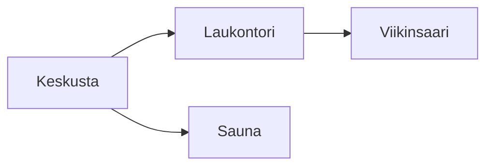

<!-- case: mermaid-labels | Diagrams | Flowchart with line labels and shapes | needs: ent:diagram -->
## Päätös

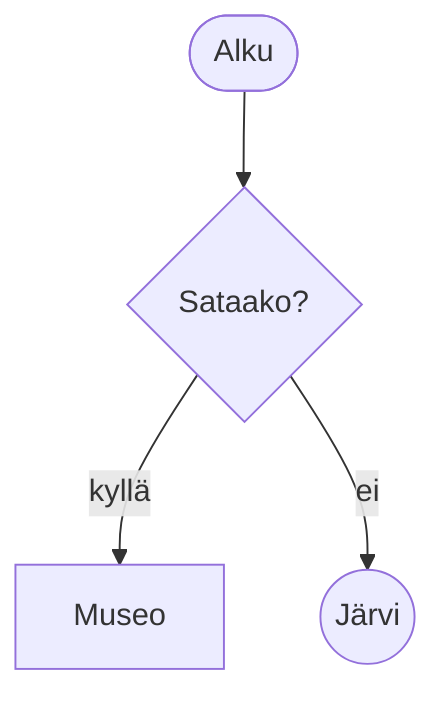

<!-- case: mermaid-subgraph | Diagrams | Flowchart with a subgraph | needs: ent:diagram -->
## Ryhmät

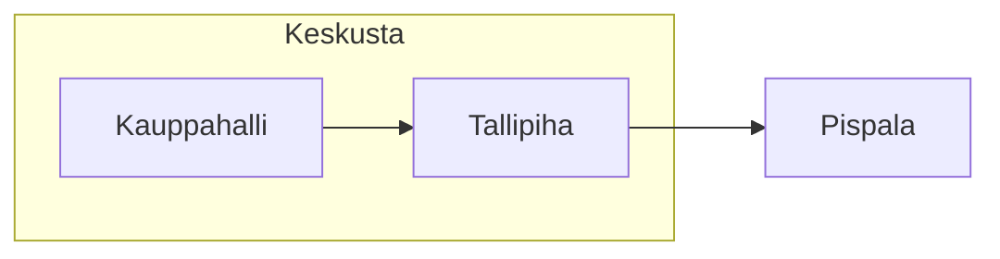

<!-- case: mermaid-style | Diagrams | Flowchart node colours (style) | needs: ent:diagram -->
## Värilliset

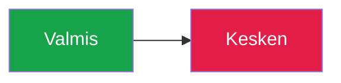

<!-- case: mermaid-sequence | Diagrams | Sequence diagram | needs: ent:diagram -->
## Viestit

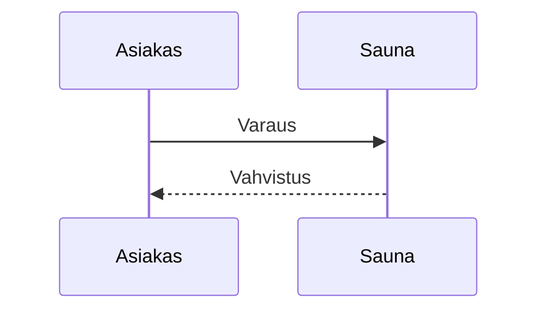

<!-- case: mermaid-class | Diagrams | Class diagram | needs: ent:diagram -->
## Luokat

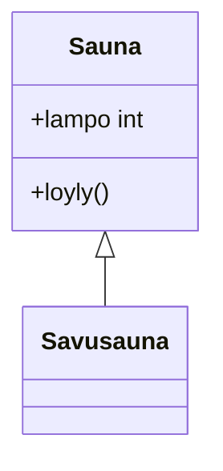

<!-- case: mermaid-state | Diagrams | State diagram | needs: ent:diagram -->
## Tilat

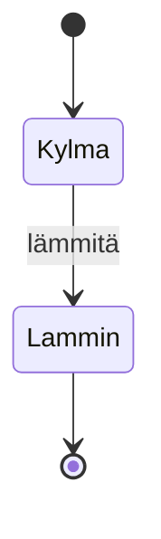

<!-- case: graphviz | Diagrams | Graphviz DOT | needs: ent:diagram -->
## Verkko

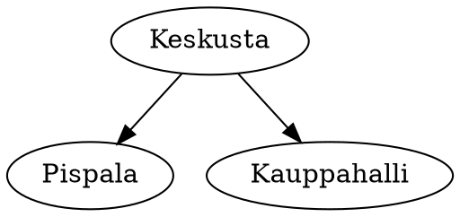

<!-- case: d2 | Diagrams | D2 | needs: ent:diagram -->
## D2

```d2
Keskusta -> Pispala: kävely
```

<!-- case: plantuml | Diagrams | PlantUML | needs: ent:diagram -->
## PlantUML

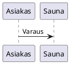

<!-- case: xstate | Diagrams | XState statechart | needs: ent:diagram -->
## Tilakone

```xstate
{"id": "sauna", "initial": "kylma", "states": {"kylma": {"on": {"LAMMITA": "lammin"}}, "lammin": {"type": "final"}}}
```

<!-- case: diagram-look | Diagrams | Diagram look {style=cartoon} | needs: ent:diagram -->
## Piirretty

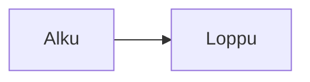
{style=cartoon}

<!-- case: diagram-beside | Diagrams | Diagram with text beside | needs: ent:diagram layout -->
## Kaavio vieressä {layout=image-left}

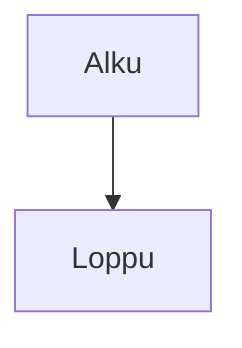

- Kaksi vaihetta
- Yksi viiva

<!-- case: build-list | Build | Build steps {.build} | needs: ent:li steps -->
## Askeleet

- Ensin
- Sitten
- Lopuksi
{.build anim=rise}

<!-- case: build-code | Build | Code highlight steps | needs: ent:code steps -->
## Koodi askelittain

```ts {.numbers lines=1|3 .build}
const a = 1;
const b = 2;
const c = a + b;
```

<!-- case: story | Build | Presenter ::: story | needs: cmd:path -->
## Kertoja

Teksti.

::: story
Tämä on ensimmäinen repliikki.
Mutta tämä on toinen.
:::

<!-- case: fx-slide | Effects | Slide effect {fx=starfield} | needs: effect -->
## Tähdet {fx=starfield}

Teksti tähtien päällä.

<!-- case: fx-own | Effects | Own effect ```fx | needs: effect -->
```fx
effect hehku source {
  still = 1
  fallback = #10202a
  output = vec3(uv.x, 0.4, uv.y)
}
```

## Oma efekti {fx=hehku}

Teksti efektin päällä.

<!-- case: fx-block | Effects | Block effect {fx=} under a paragraph | needs: effect -->
## Lohkon efekti

Tämä kappale hehkuu.
{fx=glow}
